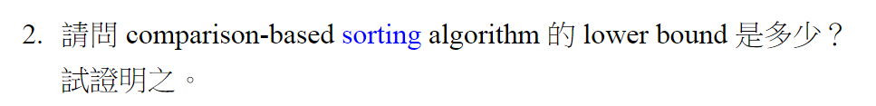
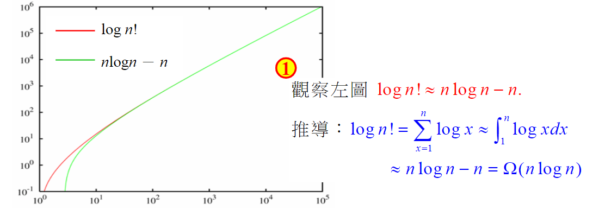
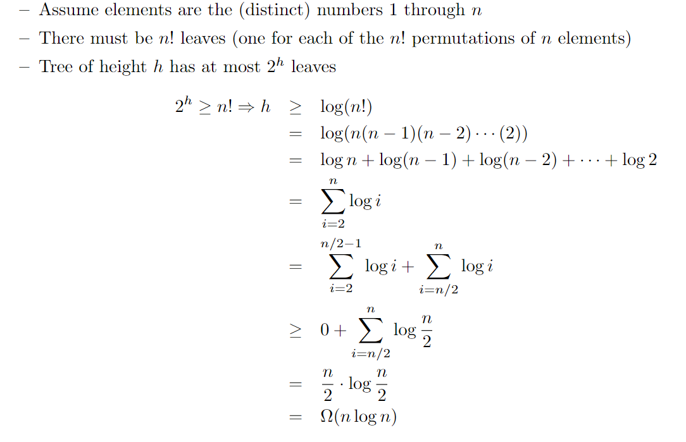

***
### 1.<p.f.>
N個data進行排序，會有n!種可能的排序結果，以排序之Decision Tree而言會有n!個葉節點

perfect binary tree樹高為h，最少有2^h個葉節點

decision binary tree的所有葉子必須包含所有的排列，所以n!<=m，m為葉子數

decision binary tree為perfect binary tree的子樹，所以m<=2^h

結合1、2，n!<=2^h，亦即執行時間 h>=log(n!)

Decision Tree又是Binary Tree，所以樹高度會 >= “log(n!)” +1 (取上界) => log(n!)

=> 比較次數h >= log(n!) >= (n/2)log(n/2)
=> Ω(nlogn)

由此可知，最快的排序時間為 Ω(nlogn)

***
### 2.<p.f.>
1. 1~n為不同的數字
2. N筆data有n!種排序結果(葉節點)
3. (perfect BT)樹高為h最少有2^h個葉節點

