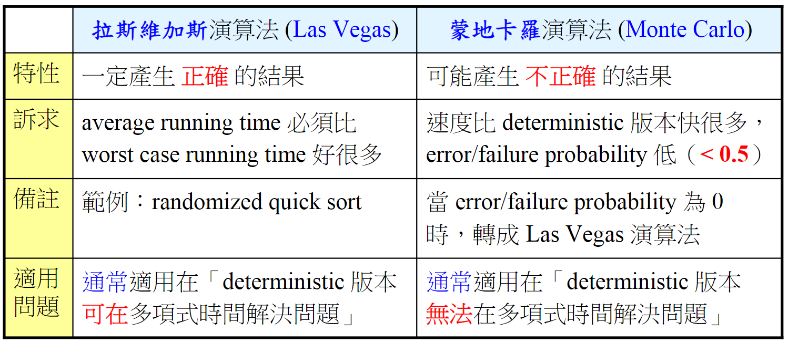

#### 蒙地卡羅演算法：
indicated ramdom varible

```C++
MonteCarlo_findcut( G(V,E) ){
    for each vertex vi in V{ //對V的每個點vi做:
        filp coin ;//擲骰子 1=人頭 0=字
        if (head) //如果是人頭，vi填入A
          vi = A;
        else      //如果是字，vi填入B
          vi = b;
    }
}
```
#### 拉斯維加斯演算法：

假設一個graph有|E|條edges，我們希望能很快地找到size至少有(>=)m/2條cut
Cut size >= m/2

```C++
LasVegas_findcut( G(V,E) ){
    do{
      cutsize = 0;
      MonteCarlo_findcut( G(V,E) ); //隨機決定A或B
      for (i=1;i<=|E|;i++){
          if(ei connect A to B) //兩邊不同陣營為cut size
              cutsize++;
      }while(cutsize < |E|/2);
    retrun (A,B);
    }

}

```


---
#### 快速排序法
```C++
quicksort(arr,l,u){
    if (l<u){
        int pivot = partition(arr,l,u);
        quicksort(arr,l,pivot-1);
        quicksort(arr,pivot+1,u);
    }
}
partition(arr,l,u){
    int pivot = arr[u]; //末項
    int i = l - 1; //首項-1
    for(j=l ; j<u ; j++){
        if (arr[j]<pivot)
            i++;
            swap()
    }
}
```
