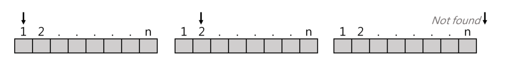
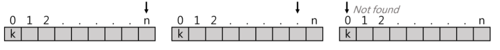

# 搜尋
作法:由頭到尾依序對Data一筆筆進行比對並搜尋，可分為:
1. Non-sential Linear search
2. Sentila Linear search

### Non-sential Linear search
Def:由頭開始對key(欲找值)搜尋
- if found => return index(位置)
-    else  => return 0

```C++
void non-sential(F[],n,key){
while (i<=n){
    if(key==F[i])
        return i;
    else
        i++;
  }
return 0;
}
```

#### 分析:
1. 時間複雜度O(n)，平均複雜度=(1+2+3+...+n)=(n+1)/2=O(n)
2. 資料無須做前置排序
3. 支援Sequential(Linked list)或Random Access(Array)之結構，皆可進行
4. 實作容易

### Sential Linear search
Def:
1. 第0格放欲找值key
2. 由後往前找key，找到則return index，否則return 0

```C++
void sential (F[],n,key){
int f[0]=k;
int i=n;
while(F[i]!=key){
i--;
}
return i;
}
```


#### 分析:
1. 效率較non-sential好，因為少一個判別式
2. 多花一格空間(以時間換取空間)
3. 時間複雜度=O(n)

### Binary search
前置作業:
1. Data需事先排序
2. 需支援Random Access(Array可以，Linked list不適合)

概念:
1. F [ i ] == k，return i
2. F [mid]>
