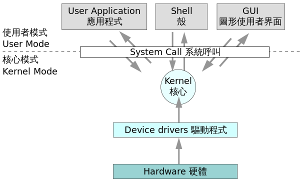

### OS簡介
作業系統是管理電腦硬體/軟體資源的電腦程式，同時也是電腦系統的核心與基石

### OS主要有以下兩個功能：
1. 資源分配者
2. 監控使用者程式，防止不正常運作造成系統危害

### 一個標準PC的作業系統應該提供以下的功能：
1. 行程管理（Processing management）
2. 記憶體管理（Memory management）
3. 檔案系統（File system）
4. 網路通訊（Networking）
5. 安全機制（Security）
6. 使用者介面（User interface）
7. 驅動程式（Device drivers）

## 常見系統類型：

### 多元程式系統（Multiprogramming System）
系統中存在多組行程(process)同時(concurrent)執行，避免CPU閒置(idle)，提高CPU利用度(ultilization)

### 分時系統（Time Sharing System）
Multiprogramming System的一種，OS透過資源分享，使每個使用者都認為有一套專屬的系統存在

常見配置：
1. process間採用RR排程
2. 記憶體為使用者共享
3. 使用Virtual Memory
4. I/O device 透過 Spooling技術(把磁碟當作一個巨大緩衝區使用)共享

### 分散式系統（Distributed System）
硬體上每台電腦都是自主的，軟體上用戶將整個系統看作是一台電腦，一般分為兩類，分別是Client-Server System與Peer to Peer

好處:
* 資源共享(Resourse Sharing)
* 加快計算速度(Speed up)
* 可靠性(Reliability)
* 通訊需求(Communication Need)

### 即時系統（Real time System）
定義嚴謹的固定時間限制，電腦在處理工作時必須在定義的時間內完成，否則工作就算失效

硬性作業系統:與即時系統定義相同
* 工廠自動化系統、軍事系統、核能安控等
* 應用程式設計上非常重要
* Data跟Program皆存在ROM跟RAM中
* 不使用虛擬記憶體，因為Page Fault的處理時間過長
* 減少OS的干預以降低分派延遲(Dispatch Latency)

### 叢集系統（Clustered System）
共享儲存裝置，集合許多CPU經由LAN連線連結以完成工作
主要是利用多台獨立的電腦系統或工作站共同完成大型數值的平行計算
