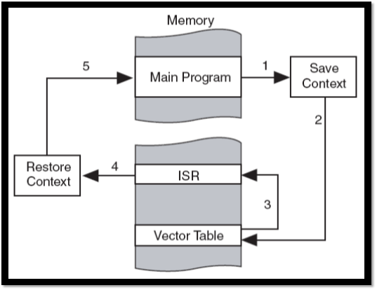
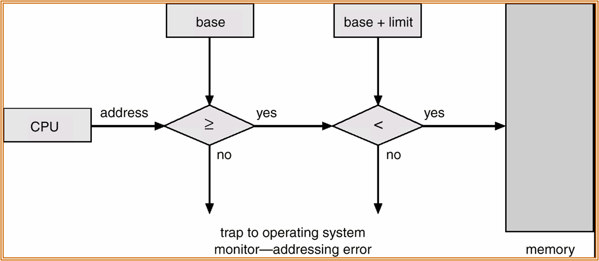

### 中斷（Interrupt）
中斷是指CPU收到硬體或軟體的訊號，表示有某個事件發生，提醒CPU這應該被注意，並執行Content Switch處理該事件

### 中斷處理流程
1. 暫停目前Process並保存此Process的執行狀況
2. OS根據Interrupt ID查詢Interrupt Vector並取得ISR(Interrupt Service Routine)的起始位置
3. 執行ISR
4. 執行完成，恢復(Restore)先前Process的執行狀況
5. 回到原先中斷前的執行

### 中斷種類
* 外部中斷:CPU周邊設備引起(I/O complete Interrupt、I/O device error)
* 內部中斷:不合法的使用所引起，CPU本身所引發(Debug、Devide-by-zero、overflow)
* 軟體中斷:user需要OS的服務時，藉由System Call呼叫OS執行相對應的ISR，完成請求後回傳結果給user program
* trap = 內部+軟體中斷

### I/O的運作方式
* Polling(Busy waiting I/O):I/O device將資訊放進狀態暫存器，CPU會週期性的檢查並取得需要服務的裝置
* Interrupt-Driven I/O:當I/O device需要服務時，發出interrupt告知CPU(非同步I/O)
* DMA(Direct Memory Access):透過DMA控制器，讓I/O device直接訪問Memory，不需要CPU的參與

##### Cycle Stealing
指CPU執行一條指令的步驟，由若干個機器週期組成
機器指令週期:
  1. 取得指令(IF，Instruction Fetch):程序計數器(PC)儲存下一個執行指令的位置，CPU按PC儲存的位置，經主記憶體取得指令的內容，透過BUS將指令存入指令暫存器(IR)
  2. 解碼指令(DE，Decode):將IR內的指令翻譯成機器語言
  3. 執行指令(EX，Excute)
  4. 儲存結果(WM):將結果寫到記憶體內

### I/O架構:
* 同步I/O(Synchronous):一段時間只有一個I/O request產生
* 非同步I/O:會有多個I/O request產生，必須使用一個表紀錄各個I/O的位置及狀況

### Dual-Mode
OS會將重大指令設成特權指令(Priviledge Instruction)，須在Kernel mode執行，以保護重要的資源。
User mode下可透過System Call請求Kernel mode執行，將結果返回給User

##### 特權指令種類
* I/O指令
* 與記憶體有關的暫存器修改指令
* Timer有關指令
* Enable/Disable指令
* 系統stop指令
* user mode切換成kernel mode指令

### I/O protection
防止User Program對I/O Device不正常使用
目的:不希望User Program直接控制I/O，造成資源不當分配，利用度低或危害系統
作法:
1. 系統必須支援Dual mode
2. 所有I/O commands設為特權指令
3. 必須保護Interrupt Vector與ISR所在的Memory Area，不被User Program任意修改

在I/O protection機制下，user program如何執行I/O?
1. I/O request
2. 執行 I/O command
3. I/O complete
4. 結果

### Memory Protection
1. Monitor Area Protection
Def:保護monitor區域不被user program修改
  * 作法一：使用Fance Register紀錄OS大小(size,Base or Limit):user program執行時欲存取做檢查
  * 須將修改Fance Register指令設成特權指令
### 　
  * 作法二：OS Monitor從低位置往高位置成長，user program相反
  * 交會時有access error

2. Job與Job之間的Memory protection
Def:防止user program企圖修改processes所在的Memory Area
做法:利用Base Register與Limit Register紀錄User program的起始位置及大小
對所有Memory address access執行下列檢查：

* 修改Fance、Base、Limit Register的指令需設為特權指令

### CPU Protection
1. 目的:防止user process無限期占用CPU不釋放
2. 做法:OS會強制設定CPU的最大時間值，利用timer紀錄此最大值，process執行後timer值減少，直到0發出timer out中斷通知OS，CPU可強制此process放棄CPU
* 設定Timer指令需設為特權指令

### Timer 用途
1. CPU protection
2. Time-Sharing Sysyem製作RR
3. DMA controler設定傳輸量(counter)
4. 計時器、系統時間
