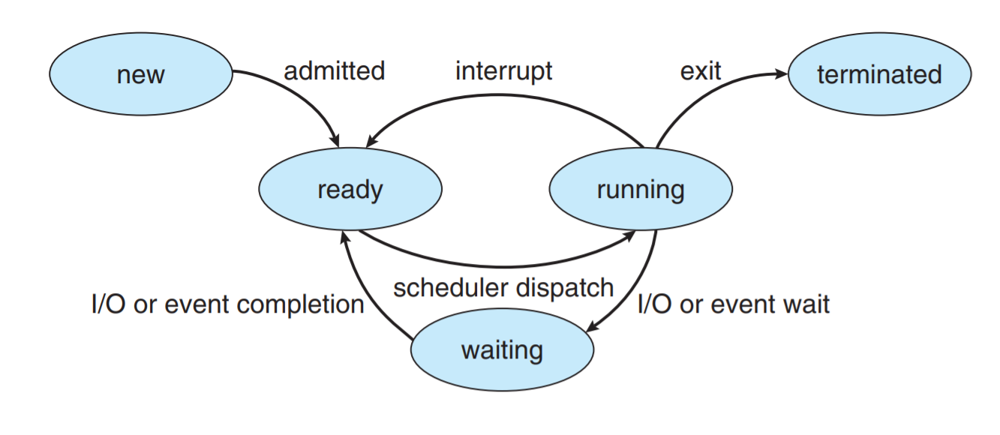
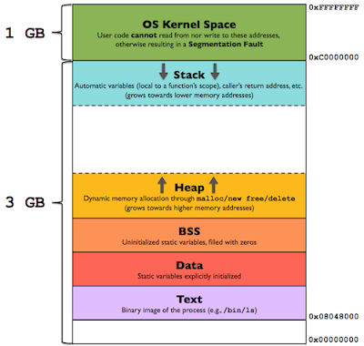

### 行程（Process）
Process是電腦中已執行程式(program)的實體，Process不是基本執行單位，是執行緒(Thread)的容器
Process需要一些資源才能完成工作，如CPU Time、Memory、File、I/O device

* 批次系統(Batch System)，Process稱為Jobs
* 分時系統(Sharing System)，Process稱為user program或tasks(任務)
* 多數情況，Jobs=Process，Process較為人接受

Process在執行時，狀態(state)會改變，state是指Process目前的動作

狀態：
* new：Process產生，分得PCB空間，尚未載入記憶體
* ready (queue)：process排班中等待CPU
* running：process正在執行
* waiting：等待某事發生，例如等待使用者輸入完成，稱為阻塞(blocked)
* terminated：完成執行

轉移：
* Admit:當memory Space足夠時，可由長程排班決定將此Job載入到記憶體中
* Dispatch：決定讓高優先權process取得CPU
* Interrupt：也叫Time-out，執行中的process會因為某事件發生，被迫放棄CPU
* Wait：叫做等待I/O complete或事件發生
* Exit：Process完成或異常中止

### Process在記憶體中的配置
stack：存放函數的參數、區域變數、返回位置等
heap：存放動態記憶體配置變數(malloc/new/free/delete)
BSS：未初始化的靜態變數
data：全域變數、已初始化的靜態變數
text：常量字元串

### Context Switch
讓多個process分享單一CPU資源計算的過程
當CPU執行context switch到另一個Process，系統會儲存舊的CPU狀態到PCB，並從新的PCB載入新的CPU狀態

交換的時機:
* 多工
* 中斷
* user mode 切換到 Kernel mode (可能)

### Process Control Block(PCB)
OS kernel中的一種資料結構，切換Process時會把未做完的process資訊記錄在PCB裡
主要內容：
1. Process ID：每個process是唯一(unique)的
2. Process state：cpu Scheduling狀態 ex:ready、running、waiting
3. program counter：放下一個執行敘述的記憶體位置
4. CPU register：紀錄使用到暫存器的值
5. CPU Scheduling info：ex:process優先度、到達時間、CPU time quantum
6. Memory management info：記憶體管理資訊 ex:Base/limit register、page table、segment table
7. Accounting info：process使用多少資源、使用多少CPU time
8. I/O status info：process發出多少I/O request，完成狀況如何，目前暫用哪些CPU資源

### CPU排程
##### 1. Long Term Sheduler(Job Sheduler)：new->ready
* 從ready queue內挑選適合的jobs載入到記憶體並執行
* 適用Batch System，不適用Time-Sharing System
* 可調控多工分支(Multiprogramming Degree)
* 可調和CPU-Bound與I/O-Bound混合比例
* 執行頻率最低
##### 2. Short term-Sheduler：ready->running
* 從ready queue挑選高優先度的process執行
* Batch System 和 Time-Sharing Sysyem 均需要
* 執行頻率最高
##### 3. Midium term Sheduler：virtual memory
* 記憶體空間不足時，CPU會挑選合適的Process將其swap out到磁碟以空出記憶體空間，記憶體足夠時再將其swap in記憶體繼續執行
* 通常用在Time-Sharing System
* 減少Multiprogramming Degree
* 可調和I/O Bound與CPU Bound混合比例

### I/O bound 與 CPU bound
* I/O bound process：花在I/O的時間多於計算，許多短暫的CPU-burst(使用CPU的時間)
ex：等待鍵盤輸入的程式
* CPU-bound process：花更多的時間做計算，很少有很長的CPU-burst
ex：壓縮程式

分派器（Dispatcher）
Def：將CPU控制權授予CPU Sheduler選出的Process
主要工作:
1. Context switch
2. kernel mode -> user mode
3. jump至選出的proesss執行區段

分派延遲(Dispatch latency)為工作時間總合
