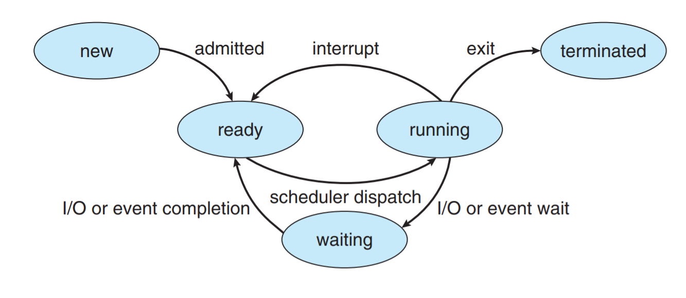
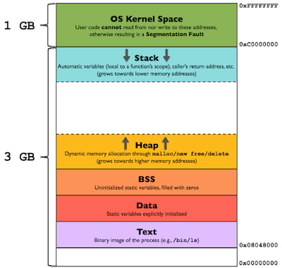

### 行程（Process）
Process是電腦中已執行程式(program)的實體，Process不是基本執行單位，是執行緒(Thread)的容器
Process需要一些資源才能完成工作，如CPU Time、Memory、File、I/O device

* 批次系統(Batch System)，Process稱為Jobs
* 分時系統(Sharing System)，Process稱為user program或tasks(任務)
* 多數情況，Jobs=Process，Process較為人接受

Process在執行時，狀態(state)會改變，state是指Process目前的動作

* new：行程產生
* running：正在執行
* waiting：等待某事發生，例如等待使用者輸入完成，稱為阻塞(blocked)
* ready (queue)：排班中等待CPU
* terminated：完成執行

### Process在記憶體中的配置
stack：存放函數的參數、區域變數、返回位置等
heap：存放動態記憶體配置變數(malloc/new/free/delete)
BSS：未初始化的靜態變數
data：全域變數、已初始化的靜態變數
text：常量字元串

### Context Switch
讓多個process分享單一CPU資源計算的過程
當CPU執行context switch到另一個Process，系統會儲存舊的CPU狀態並載入到新的CPU狀態

交換的時機:
* 多工
* 中斷
* user mode 切換到 Kernel mode (可能)

Process Control Block(PCB)
OS kernel中的一種資料結構，切換Process時會把未做完的process資訊記錄在PCB裡

### Sheduler
1. Long Term Sheduler(Job Sheduler)：new->ready
* 從ready queue內挑選適合的jobs載入到記憶體並執行
* 適用批次系統，不適用分時系統
* 可調控多工分支(Multiprogramming Degree)
* 可調和CPU-Bound與I/O-Bound混合比例
* 執行頻率最低
2. Short-term-Sheduler
* 從ready queue挑選適合
