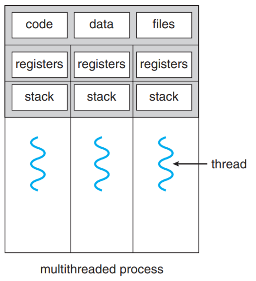
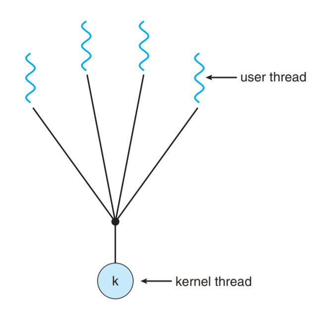
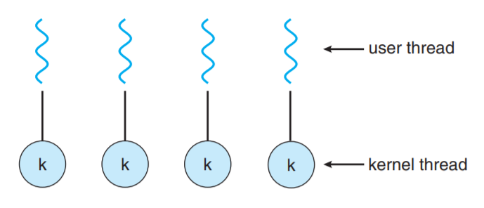
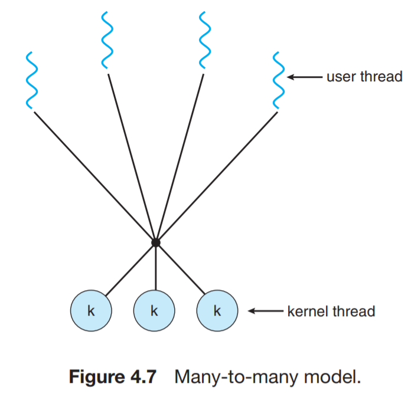

### thread簡介
thread是OS能夠排程的最小單位，一個Process內有許多個thread(Process為thread的容器)，是Process中的實際運作單位

* thread是OS分配CPU time的對象
* process是OS分配資源的對象

thread擁有以下內容：
1.thread id
2.thread state
3.program counter
4.register set
5.stack

process內的threads彼此共享：
1.code
2.data
3.file(os resources)

Process中有multi-thread的好處：
* 應答：允許程式中某部分被中斷或是執行的非常久時，該程式仍然可以繼續執行
* 資源分享：分享code data files資源
* 經濟：輕量化的Process
* 可使用多處理器架構：使用多核心

### Multi-threading介紹
#### user threads
在user mode下執行，OS不知道有這些thread存在，不需要OS介入管理
* 優點：管理成本較低
* 缺點：若process的user thread發出鎖定的system call，且kernel為single thread，則整個process被鎖住

常見的user thread：
* Pthreads(POSIX thread)
* Win32 threads
* JAVA threads

#### Kernel thread
在kernel mode執行，OS知道有這些thread存在，由OS介入管理

常見的kernel thread：
* Windows
* Linux
* Tru64 UNIX

### Multi-threading model
1.many to one 多對一
* 系統容易被single thread鎖死
* 沒有平行化
* 可攜性佳

2.one to one 一對一
* 成本較高
* 每產生一個user thread，須連帶產生一個kernel thread，kernel thread對程式的執行產生額外負擔，須限制threads產生個數

3.many to many 多對多
* 系統不會被single thread鎖死
* 比one to one 經濟
* i/o bounded thread需要加入等量的kernel thread讓執行核心忙碌

### Threading issue
fork issue：
只fork該thread：child與parent工作不同
fork整個process：child與parent工作相同

signal type：
同步訊號：非法的記憶體存取、divide by zero
非同步訊號：ctrl+c(SIGINT interrupt)

Signal handler：
default：由編譯器自動載入預設的訊號處理
user-defined：自行定義訊號處理

Thread pools：
產生多個thread等待執行，比client-server方式好(server收到client request才建立thread)

TLS(thread-local storge)：
解決thread本身資源共享的問題，在thread布置一塊空間，讓外部thread觀測

Pthread(POSIX threads)：
IEEE 1003.1c標準定義的thread標準，定義建立和操作thread的API，可用於user/kernel level，常用在UNIX系統
