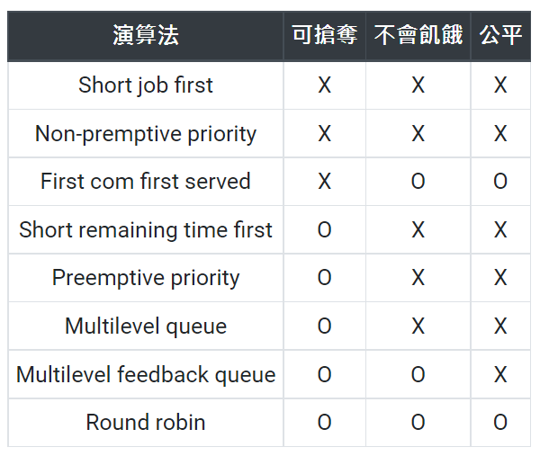

### CPU排程簡介
* CPU利用multiprogramming方法得到CPU最大使用率
* 一般process一開始都是CPU Burst後I/O Burst，先交由CPU處理該process，接著做I/O資料的傳送
* process會在此兩個狀態循環，最後呼叫system call中止process作為結束

CPU Sheduling從ready queue挑選process進入CPU執行，CPU sheduling選擇的process會在以下情況改變：
* running -> waiting (i/o or event wait)
* running -> ready (interrupt) e.g.time Sharing因為time-out回到ready
* waiting -> ready (i/o complete)
* terminated

### Starvation
Def：process因為長期無法取得完工所需資源，導致遲遲無法完工，形成indefinite blocking現象(不確定何時結束)

### non-preemptive：
Def：除非執行中的process自願放棄CPU，其他process才有機會取得，否則只能等待，不可逕自搶奪CPU
優點：
1.content switching次數較少
2.Process完成時間可預期
3.比較不會發生race condition
缺點：
1.排班效能差(可能有護衛效應)
2.不適合用在time-sharing system即real-time system

### preemptive
Def：執行中的process可能被迫放棄CPU回到ready queue等待，將CPU提供給別人使用
優點：
1.排班效能佳(waiting time、Turnaround time較少)
2.適合time-sharing system及real-time system
缺點：
1.content switch 次數較多
2.process完工時間不可預期
3.可能會發生race condition

### Deadlock
系統中的Process均在等候其他Process所擁有的資源，使得系統無法繼續運作的現象
必要條件：
1.互斥(Mutual exclusion)：系統中至少有一項資源不可共用
2.擁有和等待(hold and wait)：Process可以在等待時持有資源
3.不可搶奪(non-preemptive)：Process擁有某一項資源的使用權時，其他process不可搶奪此資源
4.迴圈等待(circular wait)：系統中所有Process均在等候Process所持有的資源，且形成循環狀態

CPU ultiliztion = cpu花在process time / cpu total time
Throughput：單位時間內完成的jobs數目
Waiting time：process在ready queue等待時間加總，直到獲得CPU控制
Turnaround time：process進入(到達)ready queue到他工作完成的這段時間差值
Response time：user 輸入命令/Data給系統~系統產生第一個回應之時間差

##CPU 排班法
### FCFS
Def：到達時間最小的process優先取得CPU
* 排班效能最差，avg waiting time與avg Turnaround time最常，結構似FIFO
* 可能有護衛效應：很多process均在等待一個很長的CPU time完成工作，造成平均等待時間大幅增加，對I/O bound process有很糟糕的影響，低I/O利用度
* 公平、簡單
* 沒有Starvation
* non-preemptive：不可插隊、不可搶先

### SJF
Def：具有最小的CPU time之process優先取得CPU
* non-preemptive：SJF
* preemptive：SRTF

優點：
1.較少waiting time(排班效益佳)
缺點：
1.不公平
2.可能有starvation(偏好short time job)
3.不適合用在short term scheduler(執行頻率太高，很難在極短時間內評估出精確的每個CPU burst time)

### SRTF
Def：新到達之process，其CPU burst < 目前執行中process剩的CPU time，可插隊執行

分析：
1.與SJF相比，SRTF的平均watting time、Turnaround time會較小，但content switching負擔較大
2.不公平、偏好short time job
3.會有starvation
4.preemptive

### priority
Def：挑選最高優先權的process優先取得CPU，優先權值相同則以FIFO為準

### RR(Round Robin)
Def：OS會設定一個CPU Time Quantum，若process未能在Quantum內完成工作，Timer會發出Time-out interrupt通知OS，強迫process放棄CPU回到ready queue
每一輪process以FIFO方式進行

分析：
1.Time-sharing system採用，是一個可參數化(Quantum)法則
2.公平(FIFO)
3.No Starvation
4.Preemptive(Running to ready)
5.q大，接近FIFO，q小，太多content switching

### multi level queue
Def
1.原本一條ready queue變成多條ready queues且高低優先權不同
2.queue之間採用preemptive priority法則
3.每個queue之間可以有自己的排班法則
4.process不允許在不同的ready queue之間移動

分析：
1.可參數化項目眾多，有助於排班設計與系統調教之彈性
ex：Queue數目、queue之間的排班法則、每個queue自己的排班法則、process被放在哪個queue的標準
2.不公平
3.有 Starvation
4.Preemptive

### multi level feedback queue
Def：允許process在不同queue之間移動

分析：
1.可參數化項目眾多
2.不公平
3.沒有Starvation
4.preemptive

### 總結

