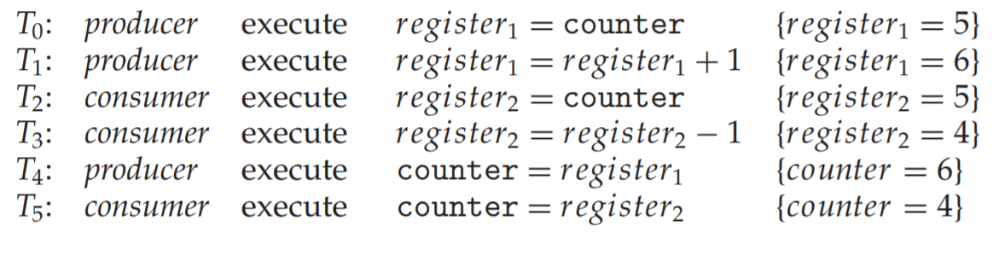
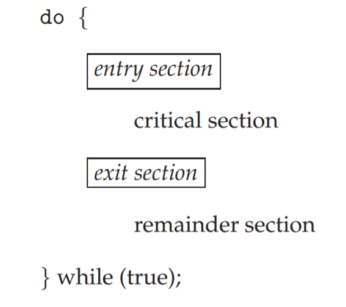
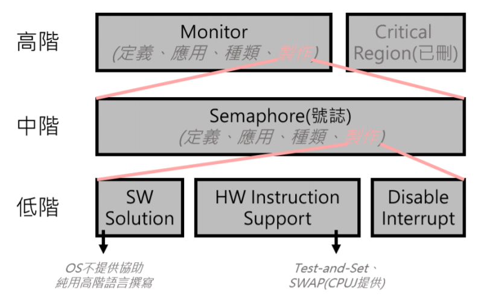
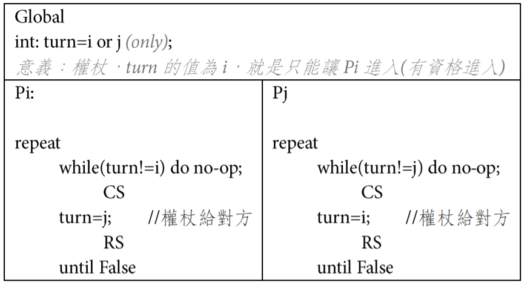
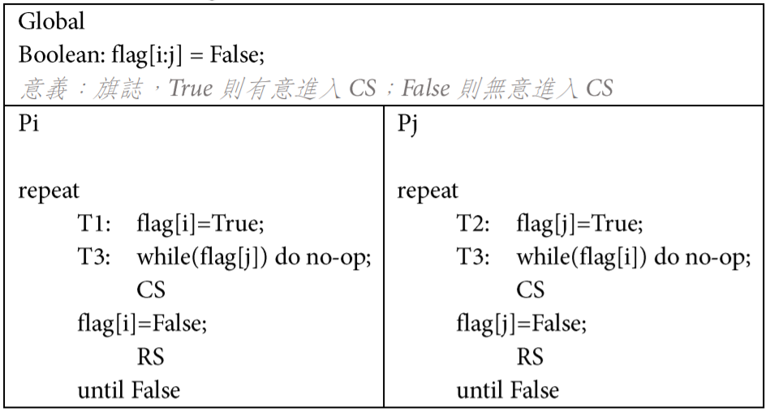
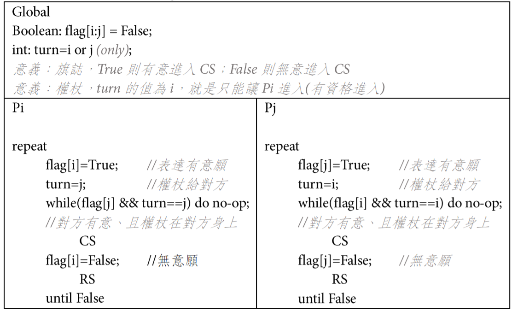

### Process communication
1.shared memory
Def：對共享變數存取(R/W)，達成溝通之目的

分析：
1.適用大量data(message)傳輸之狀況
2.傳輸速度快(不須kernel干預、支持)
3.不適合分散式系統
4.kernel不須額外支援(頂多供應shared memory space)
5.需寫額外控制程式碼防止race condition

2.Message passing
Def：Process雙方須溝通，以下步驟：
1.建立communication link
2.訊息可雙向傳輸
3.傳輸完畢，釋放communication link

分析：
1.不適用大量data傳輸
2.速度較慢(kernel須介入)
3.適合分散式系統
4.kernel須提供額外支援(ex：send/receive之system call、communication link 管理、message lost偵測、例外處理)
5.會使用OS提供的API即可

### Race condition problem
Def：在share memory communication中，若未對共享變數做互斥存取機制，可能會導致共享變數最終結果不正確(因為process之間交錯執行)

### 解決Race condition兩大策略
1.不可中斷(Disable interrupt)：對CPU下手 non-preemptive
Spinlock：多CPU 、 Disable interrupt：單CPU
2.Critical section design：對共享資料下手

### Disable interrupt
Def：Process對共享變數存取前先Disable interrupt，存取玩恢復Enable interrupt，不會被搶先

優點：
1.簡單、易實現
2.適用單一CPU
缺點：
1.不適用多CPU，須把所有CPU Disable interrupt處理，但此舉將大幅降低效能
2.風險很高：必須確認Disable後短時間內Enable，否則會有CPU永遠不回到kernel的風險

### Critical Section Design
Def：對共享變數之存取進行管制，當一Process存取時，其他Process無法存取共享變數，即使取得CPU

Critical Section(C.S)：Process中對共享變數存取敘述之集合
* 每個C.S前後需設計額外的Entry Section與Exit Section
Remainder Section(R.S)：Process除了C.S以外的區間

優點：
適合多CPU(Multi programing system)
缺點：
1.設計複雜
2.不適合單一CPU

### Busy waiting skill(spinlock)
Def：透過迴圈控制相關敘述(for、while、until、repeat...until)達到讓process暫時等待之效果，Process與Process間競爭CPU

* 當條件式==true，Process卡在while，無法離開while，達到Process暫停之效果，知道條件==false，process才會往下執行

優點：如果Process卡在迴圈的時間很短，則Spinlock十分有利
缺點：如果Process長時間才能脫離迴圈，非常浪費CPU time

### Mutex
thread進入後上鎖，必須等到進入的process解鎖後才能進入C.S.

### Semaphore
可讓多個thread進入，訊號標S保持在0~MAX之間
* S為負值時，行程會被擋住；S不為負值，thread可進入C.S.
* P（wait()），S--
* V（signal()），S++

### non-busy-waiting
將process暫停並將狀態設為Block state，直到同步事件發生使用wakeup(process)的system call將Block state切成Ready State

優點：等待中的Process不會跟其他Process競爭CPU，不會浪費CPU Time
缺點：額外付出Content Switching

### C.S滿足之三個性質
1.互斥(Mutual Exclusion)：任何時間點只允許一個Process進入C.S，其他Process不可進入

2.禮讓Progress：
*  不想進入C.S的Process不可干預其他Process進入
* 決定誰可以進入C.S的決策時間是有限的，即No Deadlock(不可以大家皆無法進入C.S)

3.有限等待Bounded waiting：自Process申請，到核准進入的等待時間(次數)是有限的，即n個Process想進入C.S，至多等待n-1次後即可進入，No Starvation，須公平對待

C.S Design 架構圖

### algo 1：turn

分析：
1.互斥(O)：turn不會同時為i,j，只會有Pi或Pj進入C.S
2.禮讓(X)：假設Pi不想進入(Pi在R.S)，且turn=i，但Pj想進入，此時Pj無法進入，必須等到turn=j才能進入
3.有限等待(O)：任何Process進入後設值成對方，等待一次後就可以進入C.S

### algo 2：flag

分析：
1.互斥(O)：Flag[i]及Flag[j]不會同時為true，一次只會有一個Flag為True
2.禮讓(X)：若執行順序為T1,T2,T3,T4，會造成deadlock產生，無法進入C.S，違反Progress
3.有限等待(O)：若任一Process進入後又想進入，會因為Flag值設定成False，需等待一次後才可再次進入

### algo 3：turn and flag

分析：
1.互斥(O)：turn值只會是其中之一，只有其中一個可以進入C.S
2.禮讓(O)：
* flag[i]==false，Pj想進入C.S，Pj必可離開while進入C.S，不會被Pi阻礙
* 若Pi跟Pj皆有意進入C.S，有限時間內必可決定turn為i或j，不會無窮等待

3.有限等待：任何一方離開C.S必將turn設定給對方，需等待對方做完後才可進入C.S
