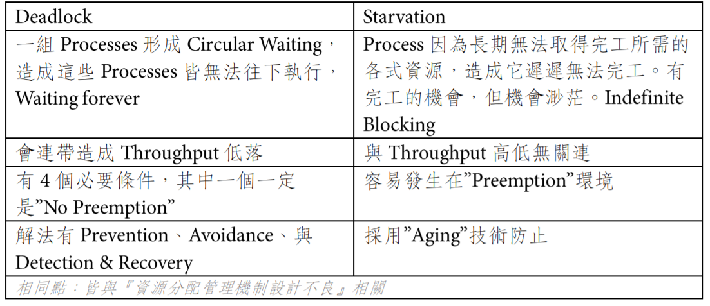

### 死結 Deadlock
Def：系統中存在一組processes彼此形成循環等待的狀況，造成processes皆無法往下執行並降低throughput(產出)之現象

### 死結成立的四個必要條件
1.Mutual Exclusion 互斥存取：
Def：同一時間內只能讓一個Process持有或使用Resource
ex：CPU、Memory、Disk
2.Hold and wiat 持有並等待：
Def：Process持有部分資源，且又在等待其他process所擁有的資源
3.No preemption 不可搶先：
Def：Process不可任意搶奪其他Process所持有的資源，必須等待其他process釋放後才有機會取得資源
4.Circular Waiting 循環等待：
Def：系統中存在一組Process形成循環等待之狀況

### 飢餓 Starvation
Def：process因為長期無法取得完工所需資源，導致遲遲無法完工，形成indefinite blocking(無限阻塞)現象(不確定何時結束)

### Deadlock vs Starvation

### RAG 三點結論
1. no Cycle -> no Deadlock
2. 有 cycle不一定有deadlock
3. 若每一資源都是單一數量，則有cycle必有deadlock

### Deadlock處理方式
1. Deadlock prevention (預防)
2. Deadlock avoidance (避免)
3. Deadlock Detection and Recovery (偵測及恢復)

1.2.：
優點：保證系統不會死結
缺點：
1. 對資源利用及取得限制多，資源利用度低，Throughput降低
2. 可能造成Starvation

3：
優點：資源利用度高，Throughput也提高
缺點：
1. 系統可能會死結
2. 偵測及恢復成本高
