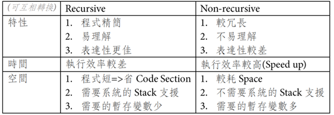

# 資料結構筆記

## CH1 遞迴(Recursive)時間複雜度(Complexity)

### Algorithm(演算法) :
##### Def:為了滿足一個特定任務之有限個指令所組成的集合
良好的演算法需滿足:
* Input>=0個
* Output>=1個
* Denfinitness(明確性):指令是清楚且不模糊(Ambiguous)的
* Finiteness(有限性):在有限的執行次數後可完成
* Effectiveness(有效性:利用紙、筆可追蹤

### Recursive(遞迴) :
##### Def:函數在執行時會再度呼叫自身(Self-Calling)

## 遞迴與非遞迴比較

### 抽象資料型態 ADT(Abstract Data Type) :
##### Def:只規範定義，但不實作的一種資料型態，是一種資料的集合
