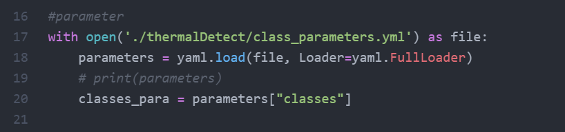

### Intel OpenVINO-toolkit
協助開發電腦視覺應用的解決方案，能提供低算力的硬體加速並最佳化，主要功能是Model Optimizer(模型最佳化)以及提供推理引擎(Inference Engine)進行推論。

### 運作流程

將訓練好的model經由Model Optimizer產生 IR檔 (中界碼)，經由推理引擎讀取 IR model進行推論，使用者就可以透過 OpenVINO Toolkit 和 Inference Engine API 整合至開發應用程式

* 中界碼(Intermediate Representation):是一種資料結構，可將輸入的資料建構為一個程式，也可以將一部份或是所有輸出的程式反推回輸入資料
* 這意味著IR將會保留一些輸入資料的資訊，同時擁有更進一步註釋或是快速查詢的功能。

模型轉換流程：Darknet→TensorFlow→OpenVINO
.weights(Tensorflow)->.pb
### Model 優化轉檔 (xml,bin)

* xml:保存神經網路(network)內的參數

* bin:保存權重(weight)的bias(偏差值)

### 安裝流程
1. 安裝OpenVINO推理引擎
2. 下載OpenVINO-YOLOV4
3. 下載yolov4.weight
4. 轉換yolov4.weights -> .pb
5. .pb轉換成供OpenVINO使用的.bin .xml檔
其中有提到如果要轉換成YOLO V4的權重文件，只能用>=openVino2021.3以上版本
6. 在OpenVINO使用推理引擎 ->測試
