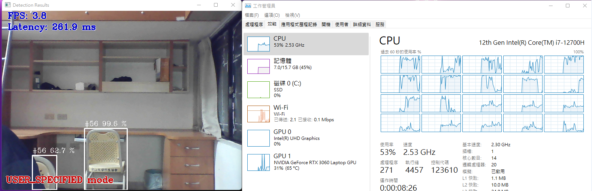

### Intel OpenVINO-toolkit
協助開發電腦視覺應用的解決方案，能提供低算力的硬體加速並最佳化，主要功能是Model Optimizer(模型最佳化)以及提供推理引擎(Inference Engine)進行推論。

---


### 運作流程


將訓練好的model經由Model Optimizer產生 IR檔 (中界碼)，經由推理引擎讀取 IR model進行推論，使用者就可以透過 OpenVINO Toolkit 和 Inference Engine API 整合至開發應用程式

* 中界碼(IR，Intermediate Representation):是一種資料結構，可將輸入的資料建構為一個程式，也可以將一部份或是所有輸出的程式反推回輸入資料
* 這意味著IR將會保留一些輸入資料的資訊，同時擁有更進一步註釋或是快速查詢的功能。

模型轉換流程：Darknet → TensorFlow → OpenVINO

.weights(Tensorflow) → .pb →  xml,bin

.pt(Pytorch) → .onnx → xml,bin

---

### Model 優化轉檔 (xml,bin)

* xml:保存神經網路(network)內的參數
~ / ITRI_Thermal_demo_v2.3.15t / k.xml


* bin:保存權重(weight)的bias(偏差值)
~ / ITRI_Thermal_demo_v2.3.15t / thermalDetect / lr_models / FP16


---
### Object Detection架構

* input：輸入圖片
* Backbone：初步提取圖片的特徵，Backbone 通常會在 ImageNet 上進行預訓練
* Neck：整合各層的 feature map
  - feature map：在多個影像上由kernel進行卷積運算(Convolution)後得到的圖片(結果)。
* Head：將 neck 整合好的特徵送入 head，用於預測 bounding box (bbox)
* one-stage (dense) ：在每個 grid 上都要預測是否有 bbox，因此稱為 dense
* two-stage (sparse) ：因為有 ROI pooling 的幫助，只需要對 ROI (region of interest) 進行預測 ，因此稱為 sparse
---

### Yolov4架構

* Backbone：CSPDarknet53
* Neck：SPP  + PAN
* Head：YOLOv3

---

### yolo v3  vs yolo v4
#### 網路架構
|      |v3 tiny|v4 tiny |改進原因|
|------|-------|-------|-------|
|Backbone         |	Darknet53|CSPDarknet53|參數減少->減少運算量並提高準確率|
|Neck             | FPN   | PANet + SPP  |提升局部特徵和全域特徵的融合，進而豐富最終特徵圖的表達能力|
|Head             | 	YOLO  | 	YOLO   |None|
|Activations|leaky-ReLU|leaky-ReLU + Mish|具有更好的泛化能力|
|Data Augmentation|Pixel-wise adjustments|Mosaic|減少 GPU 的計算|
|Regularization|Dropout|DropBlock|   |
|Normalization|Batch Normalization (BN)|Cross mini-Batch Normalization (CmBN)|更好適用於小的 batch size 上|
|Attention Module|None|Spatial Attention Module (SAM)|增加注意力機制，使得不會因為網路的加深而忘記前面的訊息|
|Loss function trick|None|Class label smoothing, Grid Sensitivity|解決在 Grid 邊緣時較難偵測到的問題|


---
### OpenVINO預訓練模型工具包
#### 規格
|      |v3 tiny|v4 tiny |
|------|-------|--------|
|TYPE             |Detection| Detection|
|GFLOPS           | 5.582   | 6.9289   |
|MParams          | 8.848   | 6.0535   |
|Source Framworks | Keras   | Keras    |

---

#### 準確度
|      |v3 tiny|v4 tiny|
|------|-------|-------|
|MAP  |0.359|0.403|
|COCO map|    0.397|      |
|COCO map(0.5)| |  0.463     |
|COCO map(0.5:0.05:0.95)   |   | 0.226  |


mAP averaged over 10 IoU thresholds and is the primary challenge metric(基本挑戰指標)

---

#### input
|      |v3 tiny|v4 tiny|format|
|------|-------|-------|------|
|origin model|[1,416,416,3]|[1,416,416,3]|[B, H, W, C]
|converted model|[1,416,416,3]|[1,416,416,3]|[B, H, W, C]

* B : Batch size
* H : Height
* W : Width
* C : Channel , origin = RGB , converted = BGR


---
#### output

##### 原始模型(Tensorflow)

The array of detection summary info

| Name |v3 tiny|v4 tiny|format|anchor_value|
|------|-------|-------|------|------------|
|conv2d_9/BiasAdd |[1,13,13,255]|   |[B, Cx, Cy, N*85]|81,82, 135,169, 344,319|
|conv2d_12/BiasAdd|[1,26,26,255]|   |[B, Cx, Cy, N*85]|23,27, 37,58, 81,82|
|conv2d_17/BiasAdd|             |[1,13,13,255]|[B, Cx, Cy, N*85]|81,82, 135,169, 344,319|
|conv2d_20/BiasAdd|             |[1,26,26,255]|[B, Cx, Cy, N*85]|23,27, 37,58, 81,82|

* B : Batch size
* Cx,Cy : Cell index
* N : number of detection boxes for cell (每個單元的偵測框數)

Detection box format [x, y, h, w, box_score, class_no_1, …, class_no_80]

* (x,y) : 中心框相對於cell的座標
* h,w : 框的原始高度及寬度，使用指數函數乘以對應的anchors得到絕對值高度及寬度值
* box score : detection box 的可信度，介於 0~1 之間
* class_no_1, …, class_no_80 : 每個Class的機率分布，介於 0~1 之間，與 confidence value 相乘得到每個 Class 的可信度

該模型基於COCO dataset上進行訓練，dataset包含80個類別的物件

---

##### 轉換後模型(keras)

The array of detection summary info

| Name |v3 tiny|v4 tiny|format|anchor_value|
|------|-------|-------|------|------------|
|conv2d_9/BiasAdd |[1,255,13,13]|   |[B, N*85, Cx, Cy]|81,82, 135,169, 344,319|
|conv2d_12/BiasAdd|[1,255,26,26]|   |[B, N*85, Cx, Cy]|23,27, 37,58, 81,82|
|conv2d_17/BiasAdd|             |[1,255,13,13]|[B, N*85, Cx, Cy]|81,82, 135,169, 344,319|
|conv2d_20/BiasAdd|             |[1,255,26,26]|[B, N*85, Cx, Cy]|23,27, 37,58, 81,82|

* B : Batch size
* Cx,Cy : Cell index
* N : number of detection boxes for cell (每個單元的偵測框數)

Detection box format [x, y, h, w, box_score, class_no_1, …, class_no_80]

* (x,y) : 中心框相對於cell的座標
* h,w : 框的原始高度及寬度，使用指數函數乘以對應的anchors得到絕對值高度及寬度值
* box score : detection box 的可信度，介於 0~1 之間
* class_no_1, …, class_no_80 : 每個Class的機率分布，介於 0~1 之間，與 confidence value 相乘得到每個 Class 的可信度

該模型基於COCO dataset上進行訓練，dataset包含80個類別的物件

---

### 安裝流程
1. 安裝OpenVINO推理引擎 (openVino2021.4 LTS)
2. 下載OpenVINO-YOLOV4

```bash
git clone https://github.com/TNTWEN/OpenVINO-YOLOV4
```
3. 下載yolov4.weight放到OpenVINO-YOLOV4資料夾
```
cd ~/OpenVINO-YOLOV4
wget https://github.com/AlexeyAB/darknet/releases/download/darknet_yolo_v3_optimal/yolov4.weights
```

4. 轉換yolov4.weights -> .pb (weight轉PB)


```bash
python convert_weights_pb.py --class_names cfg/coco.names --weights_file yolov4.weights --data_format NHWC
```


5. .pb轉換成供OpenVINO使用的.bin .xml檔 (pb轉IR)
(其中有提到如果要轉換成YOLO V4的權重文件，只能用>=openVino2021.3以上版本)


```bash
python "C:\Program Files (x86)\Intel\openvino_2021.4.582\deployment_tools\model_optimizer\mo.py" --input_model frozen_darknet_yolov4_model.pb --transformations_config yolov4.json --batch 1 --reverse_input_channels
```


6. 在OpenVINO使用推理引擎 ->測試

* 啟動openvino環境，於CMD輸入

載入openvino環境變數
```
"C:\Program Files (x86)\Intel\openvino_2021\bin\setupvars.bat"
```

測試
```
python pythondemo\2021.3\object_detection_demo_yolov3_async.py -i cam -m frozen_darknet_yolov4_model.xml  -d CPU
```


