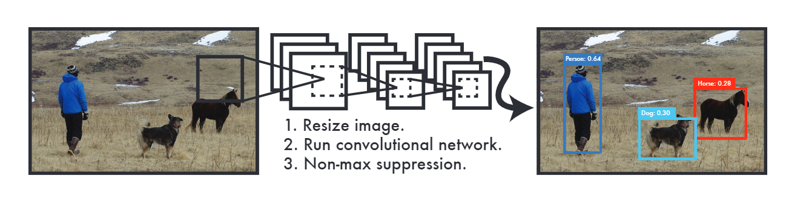
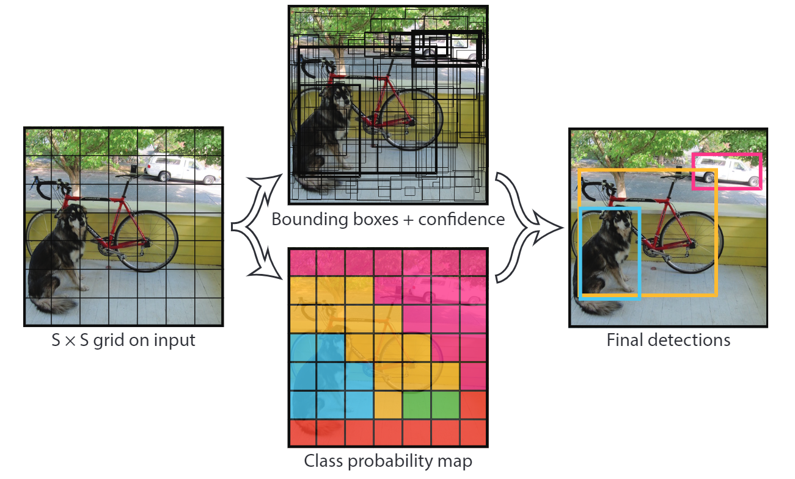

### YOLO:Real-Time Object Detection
YOLO(you look only once)是最先進的、實時物件偵測系統，顧名思義只須看一次就能辨識出物體的類別及位置，YOLO不須提前找到目標的Region，被稱為Region-Free方法，也被稱為單階段(1-Stage)model，目前已演進到v4版本。

***

### YOLO原理
我們的目標是在一張圖片中找出物體，並給出物體的類別以及位置，這裡的Object Detection是基於監督式學習，每張圖片的監督資訊是它包含N個物體，每個物體有五個資訊：
* 中心位置(x,y)
* 高(h)
* 寬(w)
* 物體所屬類別(Class)

#### Step 1. 分割圖片
YOLO第一步是分割圖片，將圖片切割成SxS(S^2)個網格(grid)，每個grid的大小皆相等。

#### Step 2. 預測Bounding Boxes與Confidence scores
對每個切割後的SxS grid單元預測B個bounding boxes

***
### Intel OpenVINO-toolkit
