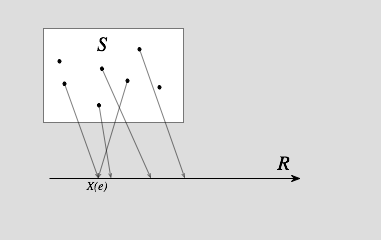
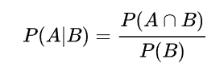
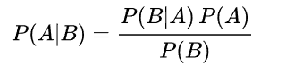
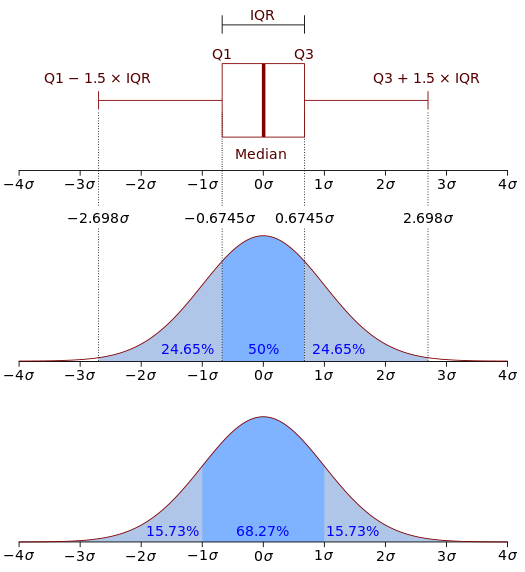
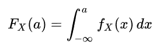
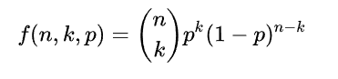
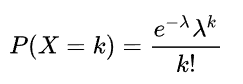

### 試驗
固定條件下重複施行的程序
* 命定試驗：固定條件下，觀測結果為確定者
* 隨機試驗：固定條件下，觀測結果非唯一，試驗實施前不能肯定結果

### 伯努利試驗
只有成功或失敗(發生或不發生)兩種結果的單次隨機試驗

### 隨機變數
將隨機試驗每一個樣本點對應實數值的函數

### 樣本空間
實驗或隨機試驗所有可能的結果的集合，S

### 古典機率
在一個隨機試驗中，假設樣本空間S為有限，且所有樣本點發生機率皆相等，則事件A發生的機率為
P(A) = #A / n

 #A為A發生之可能方法數，n為總方法數
滿足三個條件：
1. 0 <= P(A) <= 1 (事件A發生的機率介於0~1之間)
2. P(S) = 1
3. P(A)、P(B) ⊂ S 且 A ∩ B = ∅ ，則 P(A ∪ B) = P(A) + P(B)

則稱P為一機率測度，P(A)為事件A發生的機率

### 條件機率：P(A | B)
在B事件發生的條件下，A事件發生的機率，也稱為A的事後機率

### 聯合機率：P(A ∩ B)
A與B同時發生的機率

### 機率互斥：P(A ∩ B) = 0 ∧ P(A) ≠ 0，P(B) ≠ 0
當條件成立，A與B互斥，P(A | B)=0，P(B | A)=0，即兩事件不可能同時發生
如果B已經發生，則A發生的機率為0(由於A與B不能再同一場合發生)

### 機率獨立：P(A ∩ B) = P(A) P(B)
當條件成立，A事件發生，不會影響B事件，即兩事件不相關

### 貝氏定理：
已知一些條件下，某事件的發生機率
(已知事前機率，可求出事後機率)

機率加法：
 P(A ∪ B) = P(A) + P(B) − P(A ∩ B)

### 期望值：E(X)
試驗中每次可能的結果乘以其結果機率的總和

### 共變異數：Var(X)
衡量兩個隨機變數的聯合變化程度

### 變異數
一個隨機變數的變異數是描述他的離散程度，即該變數與期望值的距離

### 標準差：σ
測量資料間的分散程度

### 機率質量函數(Probability mass function，P.M.F)
離散隨機變數在各特定取值上的機率，本身不是機率

### 機率密度函數(Probability density function，P.D.F，fx)
描述隨機變數的輸出值，在某個確定的取值點附近可能性的函數

### 累積分布函數(Cumulative Distribution Function，C.D.F，Fx)
能完整描述一個隨機變數的機率分布
PDF的積分即是CDF

### 中央極限定理
大量統計獨立的隨機變數的平均值的分布趨於常態分布

### 大數法則
做大量的重複試驗，平均值接近期望值

### 二項式分布
隨機試驗出現的機率為P，n次試驗出現k次的機率為

### 卜瓦松分布
二項分布的一種極限形式，一次抽樣的機率值p相對很小，而抽取次數n值又相對很大，又稱為罕見事件分布

### 常態分布
大部分的數據集中在中間，極端值少，奏稱為鐘型曲線
