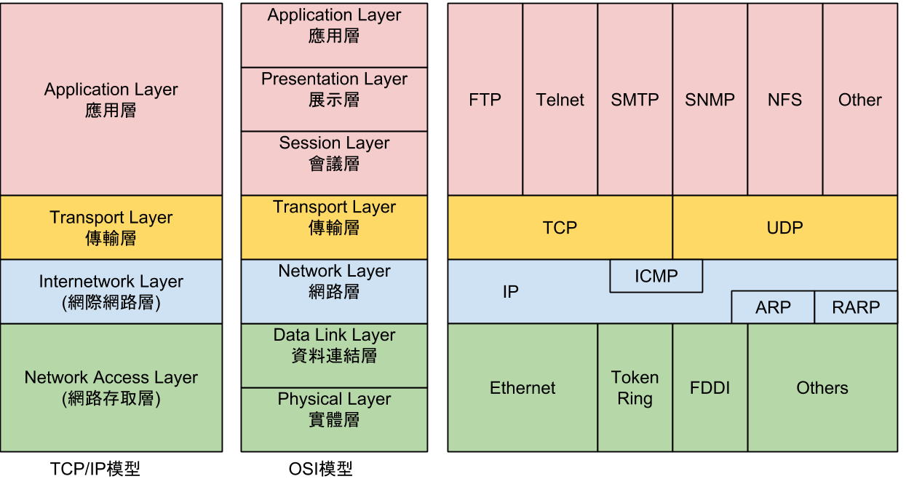
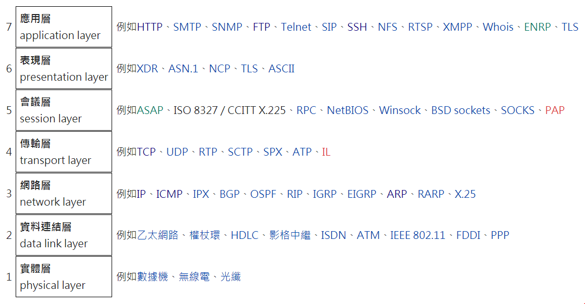

### TCP / IP 網際網路協議套組
整個網路傳輸協定家族，為網際網路的基礎通訊架構

### OSI模型

#### 實體層
Def：確保原始資料可以在各種物理媒介上傳輸

傳輸媒體(Media)：考慮衰減少，傳輸資料量大，成本低
1. 導向式媒體(guided media): 指的是實體的線材
2. 非導向式媒體(unguided media)：指的是非實體的線材

訊號編碼(Signal Coding)：定義訊號的表現方式與訊號承載資料的方式
1. 基頻編碼：直接控制訊號狀態
2. 調整載波(Carrier wave)的振幅(Amplitude)、頻率(frequency)、相位(Phase)傳輸資料

#### 資料鏈結層
Def：兩個網路實體之間提供資料鏈路建立、維持、管理，構成訊框(frame)，並進行frame定界、同步及收發順序控制

媒體存取控制子層 MAC (Media Access Control)：
* 定址：藉由MAC位置
* 框架化：上下層資料封裝(Encapsulation)
* 媒體存取方式：載波偵測多重存取(CSMA)與碰撞檢查(CD)

邏輯連結控制子層 LLC (Logical Link Control)：
* 流量控制：避免處理速度跟不上傳送速度，必須進行同步化(Synchronization)
* 錯誤修正：常用CRC，無法驗證即捨棄

#### 網路層
Def：提供路由及定(尋)址的功能，使兩終端系統能夠互連且決定最佳路徑

* 定址：使用IP位址進行唯一識別網路上的位址，依靠IP位址相互通訊
* 路由：同一網路中的內部通訊不需要網路層裝置，僅依靠資料連結層即可通訊
* 封包：網路層資料單位，分為表頭(header)及負載(payload)

#### 傳輸層
Def：提供編定序號，控制資料流量以及偵測與錯誤處理

* 連接式導向通訊：建立連線後，資料在這個連線上循序傳送
* 可靠性：封包可能在傳輸過程中遺失，通過偵錯碼(校驗和)偵測資料是否損壞
* 流量控制：控制兩節點之資料傳輸速率避免buffer overflow
* 擁塞控制：調整TCP單次傳送分組數量
* 多工：port可以在單個節點上提供多個端點

#### 會議層
Def：兩個會議層實體進行對談(Session)，而進行對話的管理服務
1. 建立連結
2. 維護連結(同步控制，保持連線)
3. 資料交換管理(單雙工)

QOS：網路服務品質，可針對使用者或是不同資料採用不同優先權

#### 表達層
Def：為上層使用者提供正確語法表示、變換，如UTF-8、ASCII格式

* 內碼轉換
* 壓縮與解壓縮
* 加解密

#### 應用層
Def：應用程式，提供網路應用服務

## 每層相關應用：
###
### TCP 傳輸控制協定 (Transmission Control Protocol)
