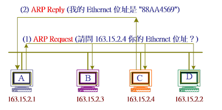
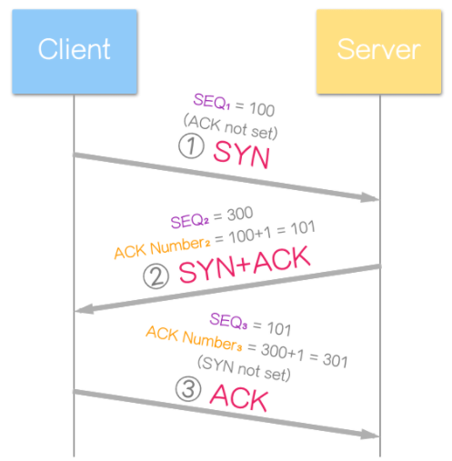
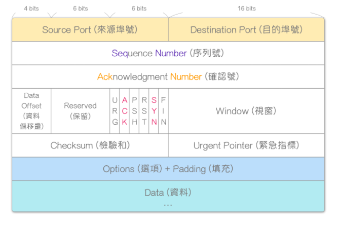

### TCP / IP 網際網路協議套組
整個網路傳輸協定家族，為網際網路的基礎通訊架構

### OSI模型

#### 實體層
Def：確保原始資料可以在各種物理媒介上傳輸

傳輸媒體(Media)：考慮衰減少，傳輸資料量大，成本低
1. 導向式媒體(guided media): 指的是實體的線材
2. 非導向式媒體(unguided media)：指的是非實體的線材

訊號編碼(Signal Coding)：定義訊號的表現方式與訊號承載資料的方式
1. 基頻編碼：直接控制訊號狀態
2. 調整載波(Carrier wave)的振幅(Amplitude)、頻率(frequency)、相位(Phase)傳輸資料

#### 資料鏈結層
Def：兩個網路實體之間提供資料鏈路建立、維持、管理，構成訊框(frame)，並進行frame定界、同步及收發順序控制

媒體存取控制子層 MAC (Media Access Control)：
* 定址：藉由MAC位置
* 框架化：上下層資料封裝(Encapsulation)
* 媒體存取方式：載波偵測多重存取(CSMA)與碰撞檢查(CD)

邏輯連結控制子層 LLC (Logical Link Control)：
* 流量控制：避免處理速度跟不上傳送速度，必須進行同步化(Synchronization)
* 錯誤修正：常用CRC，無法驗證即捨棄

#### 網路層
Def：提供路由及定(尋)址的功能，使兩終端系統能夠互連且決定最佳路徑

* 定址：使用IP位址進行唯一識別網路上的位址，依靠IP位址相互通訊
* 路由：同一網路中的內部通訊不需要網路層裝置，僅依靠資料連結層即可通訊
* 封包：網路層資料單位，分為表頭(header)及負載(payload)

#### 傳輸層
Def：提供編定序號，控制資料流量以及偵測與錯誤處理

* 連接式導向通訊：建立連線後，資料在這個連線上循序傳送
* 可靠性：封包可能在傳輸過程中遺失，通過偵錯碼(校驗和)偵測資料是否損壞
* 流量控制：控制兩節點之資料傳輸速率避免buffer overflow
* 擁塞控制：調整TCP單次傳送分組數量
* 多工：port可以在單個節點上提供多個端點

#### 會議層
Def：兩個會議層實體進行對談(Session)，而進行對話的管理服務
1. 建立連結
2. 維護連結(同步控制，保持連線)
3. 資料交換管理(單雙工)

QOS：網路服務品質，可針對使用者或是不同資料採用不同優先權

#### 表達層
Def：為上層使用者提供正確語法表示、變換，如UTF-8、ASCII格式

* 內碼轉換
* 壓縮與解壓縮
* 加解密

#### 應用層
Def：應用程式，提供網路應用服務

## 每層相關應用：
### 資料鏈結層
#### ARP：位址解析協定

Def：解析ip位置來尋找MAC位置

運作方式如下圖所示。首先主機 A 欲透過 Ethernet 網路傳送訊息給 IP = 163.15.2.4 主機，則發送出 ARP Request 廣播到所屬網路區段內。所有主機都會接收到該 ARP Request 封包，並分解是否詢問自己，如果不是就不予理會而拋棄。主機 C 收到 ARP Request 後，發現詢問自己則回應 ARP Reply（包含 Ethernet 位址）給發問者

#### IP 網際網路協定
網路層整要協定，用於網路封包交換資料的協定
IP封裝：資料在ip網際網路中傳送時會封裝成資料包(封包)
IP功能：
ipv4：arp協定，將ip解析成mac位置
ipv6：NDP(鄰居發現協定)，在鏈路上發現其他節點相對應的IP位置
可靠性：接受方通知傳送方資料是否成功接收，缺乏可靠性將可能會導致資料損壞、遺失封包、資料重複、傳遞亂序問題

ipv4透過在路由器節點上計算校驗和確保ip表頭是正確的

ipv4：32bits
ipv6：128bits

#### TCP傳輸控制協定
連接導向的、可靠的傳輸層通信協定

運作方式：
* 連接建立 connection establishment
* 資料傳送 data transfer
* 連接終止 connection termination

##### three-way handshake

1. SYN
client隨機設定初始序號SEQ1，ACK未設置(0)，flag SYN設定為1表示送出SYN資訊
2. SYN+ACK
server隨機設定初始訊號SEQ2，ACK設定為SEQ1+1告知client已收到SYN1封包，希望下次能收到client封包序號為SEQ+1，flag SYN=1、ACK=1，表示有SYN、ACK資訊
3. ACK
client送出SEQ1+1，ACK=SEQ2+1(希望下次能收到SEQ2+1)，flag ACK=1

##### TCP 表頭格式 (TCP Header Format)

Window Size：告知別人可接受的windows size大小，為自己可承受的程度

#### DNS 網域名稱系統
域名及IP位置對應的一個分散式系統，可快速解析ip位置

#### ICMP (Internet Control Message Protocol)網際網路信息控制協定
Def：訊息診斷，用於IP中傳送控制訊息，提供可能發生在通訊環境中的問題回饋，使用者可針對發生的問題診斷，常用ping與traceroute

TTL(Time to live)：轉發處理多少次，路由器轉送ICMP封包時將TTL-1，到0時代表TTL已到期，將傳送錯誤信息傳送給原網路設備

#### IPSec
Def：透過對封包進行加密及認證保護IP協定的網路協定族

#### RIP(Routing Information Protocol) 路由資訊協定
Def：透過不斷交換資訊讓路由器動態適應連接的變化，包括可以到達哪些網路，網路有多遠等等

### TCP 傳輸控制協定 (Transmission Control Protocol)
