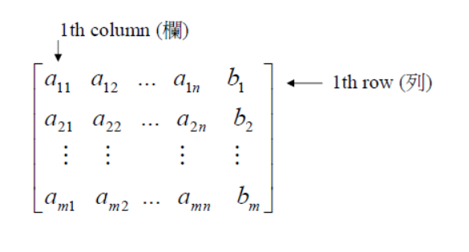
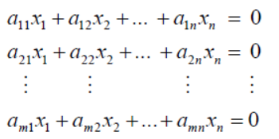
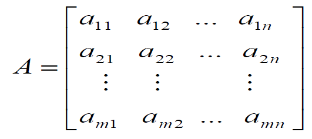
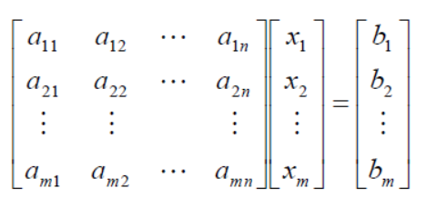
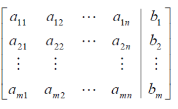
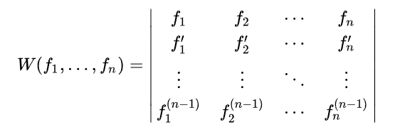

### 線性系統
變數x1,x2,...,xn的一個線性方程集合稱作線性系統或是線性方程式

### 通解
含有任意常數的解

### 特解
含有特定常數的解

### 行列式
方陣上計算得到的純量，可以看做面積或體積在歐幾里得空間的推廣

### 增廣矩陣
只留係數在方陣中的矩陣

### 列運算
解決線性方程組的方法

### 高斯消去法 G.E
由領導1(leading 1)排成梯形，每一行除了領導1，其他元素均為0，代表含有軸(樞紐)變數(pivot variable)

其他行稱為自由變數(free variable)，軸變數由樞紐變數所組成

### R.R.E.F(reduced row-echelon form)
除了領導1，其他元素均為0，排成簡列梯形的矩陣

### R.E.F(row-echelon form)
領導1底下元素均為0，排成列梯形的矩陣

### 齊次方程系統 Ax=0

* 常數項均為0
* 具有顯然0解(trivial solution)
* 系統解有 僅顯然0解 與 無窮多組解 兩種可能
* 若齊次方程組有n個未知數，rref下有r個非0行，則有n-r個自由變數

### mxn矩陣表示

Aij [mxn] 表示，第i列第j行元素，共m列n行

### 線性系統矩陣形式
Ax = b

[ A | b ]

### 轉置矩陣 A^T
A是任意mxn矩陣，轉置之後變成A^T nxm

性質：
* (A^T) ^T = A
* (A+B) ^T = A^T + B^T
* (cA)^T = c A^T
* (AB)^T = B^T A^T

### 反矩陣 A^-1
當一矩陣符合左逆及右逆，即AB=BA=I性質(乘法交換律)，且A,B是方陣，則稱A為可逆或非奇異矩陣，A,B互為反矩陣

求法：
1. 伴隨矩陣法
矩陣A為可逆，則

adj為伴隨矩陣，det為行列式值

2. 初等轉換法

將 [ A | I ] 列運算可得 [ I | A^-1 ]

### 消去律 AB=AC(A!=0)，則B=C
矩陣運算中不成立

當B、C均為A的反矩陣，B=C成立

### 列基本矩陣 Ek
一個nxn(方陣)基本矩陣是由一個單位矩陣In做一次列運算而得的矩陣

Eij (i列j列互換)
Ei(c) (第i列乘上c倍)
Eij(c) (第j列乘上c倍加到第i行)

若方陣A可逆，則A列等價於I

### 列等價
經過n次列運算後能變成另一者，列等價之矩陣有相同的rank

### 等效敘述式
若A為n*n(方陣)，則下列敘述等效
* A為可逆(A列等價於I)
* Ax=0只有顯然0解(A~I)
* Ek * Ek-1 * ... * E2 * E1 * A = I(A可用基本矩陣表示)
* Ax=b，則A是相容的(有明顯解)，僅有一解
* det(A)!=0

### 線性獨立、線性相依
f1,f2,...fn為向量空間F的向量，若存在不全為0的常數c1,c2,...,cn，使得 c1f1 + c2f2 + ... + cnfn = 0 ，為齊次方程式有顯然0解

* 如果僅有一組顯然0解，則稱全體向量線性獨立(表示某一向量不可以被表示成其他向量線性組合)
* 如果不全為0的常數c存在至少一組解，則稱全體向量線性相依(表示某一向量可以被其他向量線性組合)

### Wronskian 行列式
對於 n 個n-1 次連續可微函數 f1、...、fn，它們的朗斯基行列式 W(f1, ..., fn) :

W!=0，線性獨立
W=0，線性相依

### 展延空間 Spanning space
V為向量空間，向量{f1,f2,...,fn} ∈ V，V中任意向量x可以表示成{f1,f2,...,fn}的線性組合，x=c1f1+c2f2+...+cnfn，稱{f1,f2,...,fn}為向量空間V的生成集(Spanning set)，或稱{f1,f2...,fn}向量集的展延空間為V，V = span{f1,f2,...,fn}

### 基底 basis
構成向量空間的向量集合，基底間彼此線性獨立

### 子空間 subspace
線性子空間U是向量空間V的子集，滿足加法封閉性及數乘封閉性，x、y為any vector，a、b為純量，滿足ax+by ∈ U成立，稱U為V的子空間

### 正交 Orthogonality
空間中兩向量內積=0，垂直為正交的推廣

### 正交集
一個集合中所有相異的向量均正交，稱為正交集

### 範數 norm
向量的長度稱為範數或向量的絕對值

### 秩 rank
指線性獨立的行向量或列向量最大個數
* 梯形矩陣：rankA指的是pivot個數，軸列數，軸行數
* 線性獨立：最大獨立行、列向量數
* 維數：子空間維度數

### 四大空間
列空間 RS(A) or R(A)
* 矩陣A中各列的線性組合
* 零空間的維度為r

行空間 CS(A) or R(A^T)
* 矩陣A轉置後各列的線性組合
* 零空間的維度為r

零空間 Ker(A) or Null(A)
* 滿足Ax=0的解集合(kernel)
* 零空間的維度為n-r

左零空間 LKer(A) or Null(A^T)
* 滿足A^T=0的解集合
* 零空間的維度為m-r

### 線性映射
兩個向量空間保持向量加法及純量乘法(可加性及齊次性)的特殊映射

### 特徵向量特徵值 Ax=λx
非0向量x受到矩陣A線性映射作用後，其結果會是x的簡單長數倍(λ)，即Ax=λx，x稱為特徵向量，λ稱為特徵值

幾何解釋：λ若為實數，畫一條過原點的特徵向量，直線上的任意向量被A作用後，結果仍然會在直線上

### 求解特徵值
Ax = λx
Ax - λx = 0
x(A-λ) = 0
x(A-λI) = 0 ， 為奇異矩陣，其行列式=0
det(A-λI) = 0

解特徵方程，得到特徵值
