### 取樣(Sampling)
連續時間訊號 -> 離散時間訊號
* 取樣定理:有限頻寬之訊號，且採樣頻率>最大頻率2倍(奈奎斯特頻率)，則原來的連續訊號可以從採樣樣本中完全重建出來
* 混疊效應(膺頻):信號取樣後頻譜發生重疊之現象，取樣頻率低於2倍奈奎斯特頻率

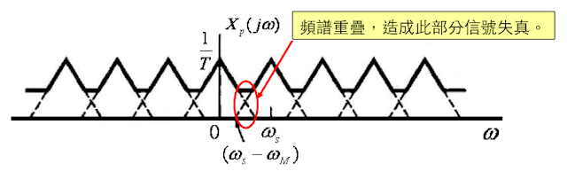

以下兩種措施可避免混疊的發生：
* 提高採樣頻率，使之達到最高訊號頻率的兩倍以上；
* 引入低通濾波器或提高低通濾波器的參數；該低通濾波器通常稱為抗混疊濾波器
### 量化(Quantization)
離散時間訊號 -> 數位訊號
* 數位訊號使用二進位記錄

### 能量訊號
無窮時間的訊號能量$E∞$<$∞$，無窮時間的訊號功率$P∞$=0
無窮區間有限數值
有限區間有限數值
能量訊號才可直接進行傅立葉轉換
### 功率訊號
$E∞$=$∞$，$P∞$>0
無限區間有限數值

### MIMO 多輸入多輸出訊號
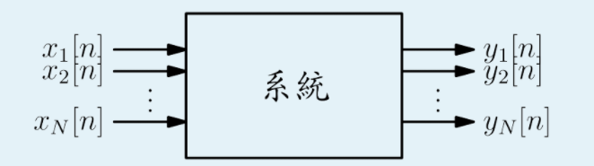

### 系統連結方式
串聯:系統1接至系統2輸入
並聯:系統1、系統2輸入相同，系統1與系統2輸出相加
回授:系統1輸出接至系統2輸入，系統1的輸入為外部輸入與系統2相加

### 系統基本性質
#### 記憶性
* 無記憶性:Memoryless，系統輸出僅與目前系統輸入有關
* 有記憶性:with memory，系統的輸出與先前輸入輸出相關
* 無記憶性元件:電阻、二極體、組合電路
* 有記憶性元件:電容、電感、記憶體、序向電路

#### 可逆性
系統為可逆，存在逆系統，將逆系統串聯在原系統後端可得原輸入訊號

#### 因果性
輸出只跟現在或過去的輸入訊號有關，與未來無關
* 無記憶性元件必具有因果性

#### 穩定性
有界的:訊號數值不為$∞$，
穩定的:輸入訊號x[n]對其所有的時間n為有界的，其輸出訊號y[n]也是有界的

BIBO:有界的輸入得到有界的輸出

#### 時變性
系統在不同時間點輸入訊號，可得不同的輸出結果

#### 線性
系統輸出會與輸入訊號的線性組合相關
* 系統線性，系統輸出易計算、易設計

#### LTI系統:線性非時變系統
* 線性:容易分析、實現
* 非時變:多數電子系統具有此特性
遞迴、延遲、恆等、累加器皆為LTI系統
優點:
1. 可使用傅立葉分析計算頻率響應
2. z transform:Z轉換是把一連串離散訊號，從時域轉為複頻域表示

### 摺積分
定義
連續：
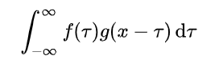
離散：
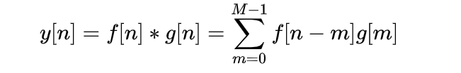
可以被看作是「滑動平均」的推廣

### 傅立葉轉換F.T
定義:
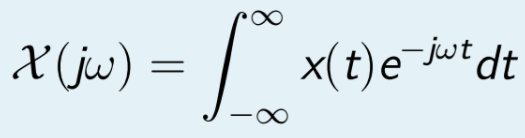
作用:時域信號轉成頻域信號

### 2D comvolution sum
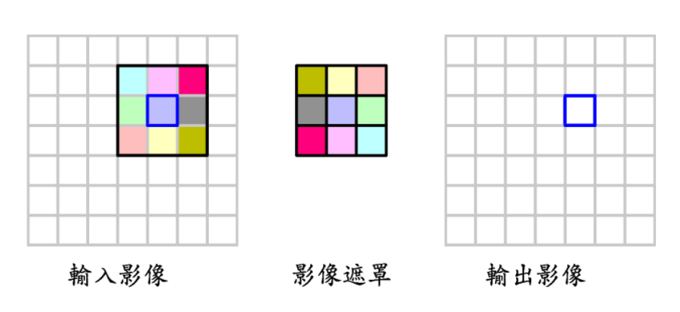

### Spectrum(頻譜)
低頻:訊號變化慢
高頻:訊號變化快

### 振幅(Amplitude)
代表頻率的強度，永遠>=0

### 相位(Phase)
代表訊號的位置資訊，以2π為週期

### 奇對稱
1. x[t]=-x[-t]
2. ω0與-ω0差一個正負號

### 偶對稱
1. x[t]=x[-t]
2. ω0與-ω0相同正負號

e^st與z^n為LTI系統的eigen vector
### 訊號與系統的頻率分析
* 訊號:計算訊號所具有的高低頻成分
* 系統:系統對於高低頻輸入的增益(gain)

### 頻率響應
對系統輸入一個振幅不變、頻率變化的訊號，測量系統相對於輸出端的響應

### Gibbs現象
有限正弦波疊加逼近原周期信號
* 諧波次數N的大小決定逼近原波形的程度
* 不連續點出現高頻波紋
* N增加，波紋會向不連續點壓縮，但波紋峰值不變
### 離散時間傅立葉轉換DTFT
時域上離散，F.T後頻域上具週期性
### 離散傅立葉轉換DFT
時域上有週期，F.T後離散，可視為DTFT在頻域上取樣
計算複雜度O(n^2)
### 快速傅立葉變換FFT
快速計算DFT或逆變換的方法，將DFT矩陣分解為稀疏矩陣因子之積
計算複雜度O(nlogn)

### 傅立葉分析之比較
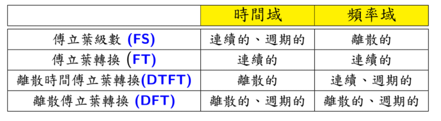

### 傅立葉函數圖形
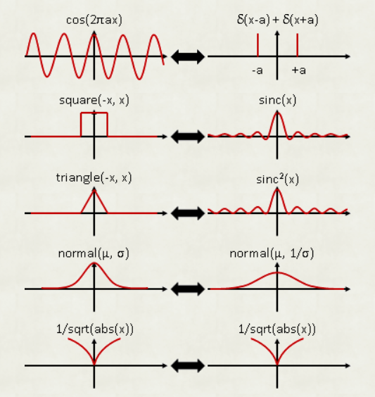
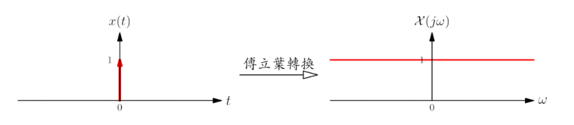
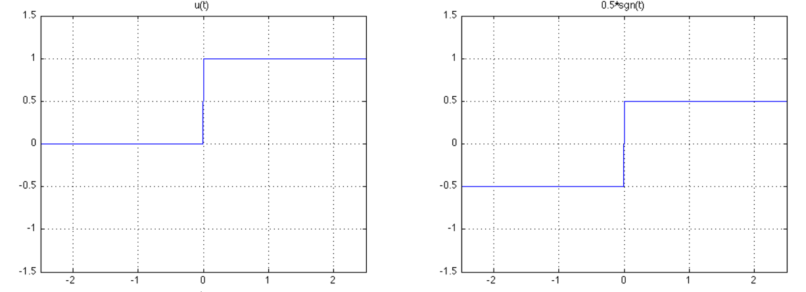

### 濾波
通帶:輸出接近原輸入訊號，y(t)=1
斥帶:訊號被濾除，y(t)=0

### 濾波器
低通:讓低頻通過，高頻不通過
ex:重低音喇叭
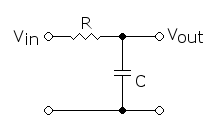
高通:讓高頻通過，低頻不通過
ex:高音喇叭

### 調變
* 訊號和載波合成的技術
* 頻譜搬移到任意位置，從而有利於訊號的傳送，並且使頻譜資源得到充分利用
### 解調變
調變資料解得原來訊號

### 調變方法:
AM、ASK

QAM:2個正交載波進行振幅調變，相位差90度(pi/2)，充分利用帶寬與抗雜訊能力強

FM、FSK

PM、PSK

OFDM:大量緊鄰的正交子載波，高資料傳輸與有效抗衰減

展頻:將訊號頻譜打散、相較原始頻寬變寬，常用無線通訊領域，抗雜訊、電磁干擾、良好資料隱密性

CDMA:分碼多址

### 頻寬
指訊號所占據的頻帶寬度

### 譜密度PSD(Power Spectral density)

### 訊噪比SNR
比較訊號和雜訊強度的比例，表示抗雜訊能力的強度
