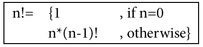
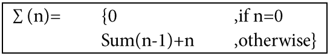
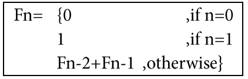

# 資料結構筆記

## CH1 遞迴(Recursive)時間複雜度(Complexity)

### Algorithm(演算法) :
##### Def:為了滿足一個特定任務之有限個指令所組成的集合
良好的演算法需滿足:
* Input>=0個
* Output>=1個
* Denfinitness(明確性):指令是清楚且不模糊(Ambiguous)的
* Finiteness(有限性):在有限的執行次數後可完成
* Effectiveness(有效性):利用紙、筆可追蹤

### Recursive(遞迴) :
##### Def:函數在執行時會不斷呼叫自己(Self-Calling)，直到中止條件觸發，返回結果。


## 遞迴與非遞迴比較


### 抽象資料型態 ADT(Abstract Data Type) :
##### Def:只規範定義，但不實作的一種資料型態，是一種資料的集合

### Function calling 過程:
1.將函式相關資訊儲存到Stack
2.將參數給予被呼叫函式
3.被呼叫函式執行
4.回傳結果，並執行之前的函式(pop from stack，if stack==NULL，then stop)

### call by value(傳值)
參數A的值由另外一個參數B接收，兩者的記憶體位置不同，參數各自獨立不連動

### call by adress(傳址)
參數A的地址由參數B接收，兩者記憶體位置不同，B修改值可連動A

### call by reference(傳參考)
參數A與參數B共用同一組變數，記憶體位置相同，B相當於給A取別名、外號

### 遞迴呼叫會將
- Parameter(參數)
- local variable (區域變數)
- Retrun Address(返回地址)

存在 stack 中，以利後續回到原程式中

### 常見遞迴程式

#####階層

```C
int f (int n){
  if (n==1)
  return 1;
  else
  return n * f(n-1);
}
```

#####1+2+...+n

```C
int f (int n){
  if(n==0)
  return 0;
  else
  return n+f(n-1);
}
```

#####費式數列

```C
//遞迴
int f(int n){
    if(n==0)
      return 0;
    else if(n==1)
      return 1;
    else
      return f(n-1)+f(n-2);
}
//非遞迴
int f(int n){
  f[0]=0;
  f[1]=1;
  for(int i=2;i<n;i++)
    f[i]=f[i-1]+f[i-2];

  return
}
```
