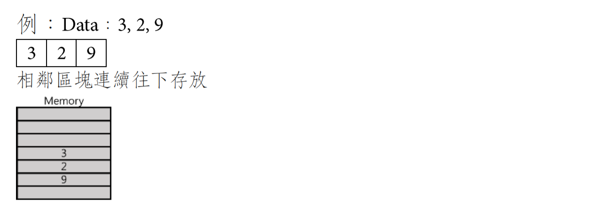
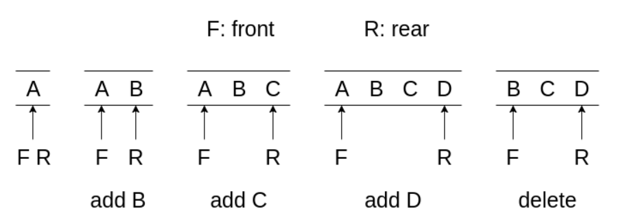

CH2

### 陣列(Array)
Def:是用來表示有序串列(Order list)的一種資料結構，為一連續的記憶體

### 鏈結串列(Linked list)
Def:為節點(node)所構成的有限集合，node包含資料欄位以及指向下一node的指標

### 兩者比較
陣列:彈性差、省空間、可支援隨機存取
鏈結串列:彈性佳、耗空間、只支援循序存取

### 堆疊
Def:具有LIFO結構的有序串列集合，特點為有一top指向元素的頂端

應用:
- 遞迴呼叫
- 後序計算
- DFS
- 回文檢查
- 老鼠走迷宮

### 佇列
Def:具有FIFO結構有序串列集合，特點為rear端增加元素、front端刪除元素

應用:
- OS Scheduleing的ready queue
- 日常排隊
- 模擬(simulation)效能評估
- Binary Tree的層序追蹤(Level Order Traversal)
- I/O device 使用 queue 接收 I/O request
- I/O buffer 常用 queue
- BFS、DFS
- Priority queue

### Circular Linked List 環狀鏈結串列
指最後一個節點會指向第一個節點形成環狀鏈結串列
* 任一節點皆可拜訪所有節點一次
* 串列回收容易(O(1))

### Double Linked List 雙向鏈結串列
每個節點中有兩個指標，指向前一個及後一個節點
