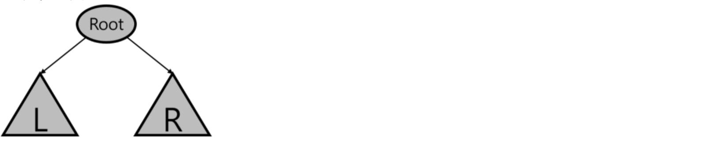
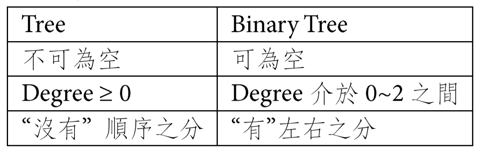
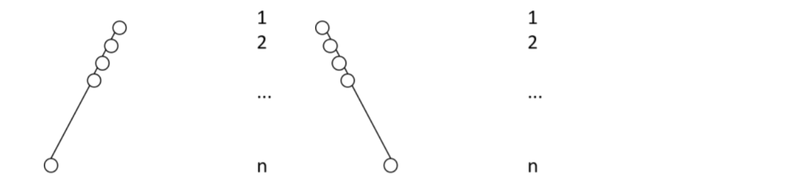
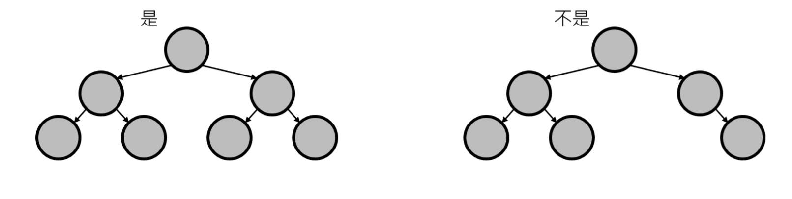
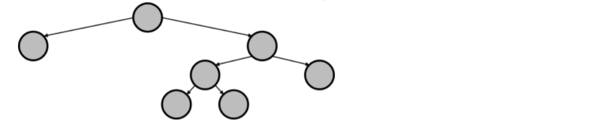
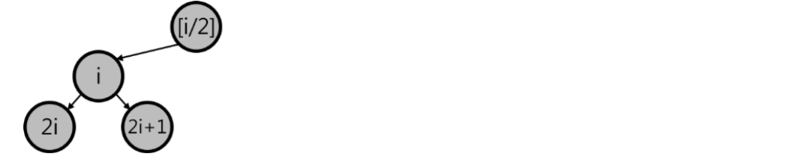
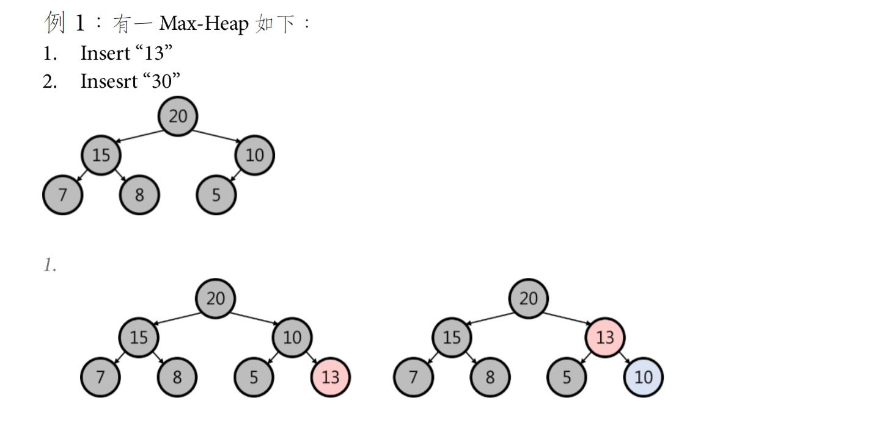
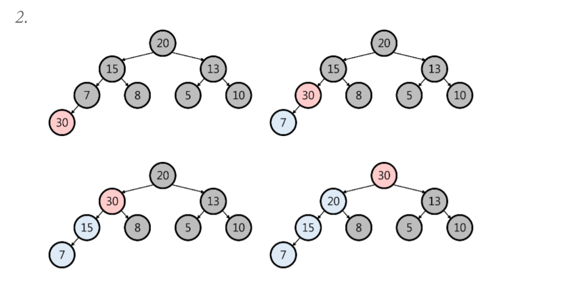
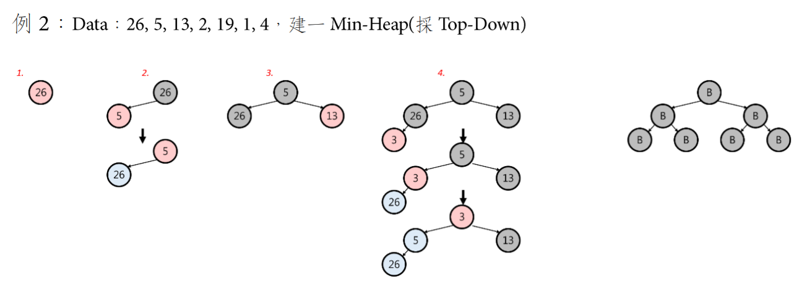
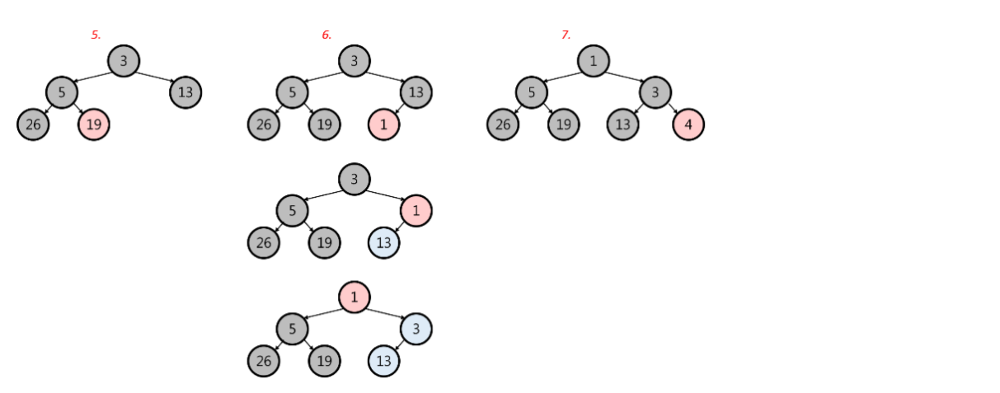

### 樹(Tree)
為一個node或多個node構成的集合，有一特定node為root，其餘皆為root之SubTree(子樹)

### 森林(Forest)
由0~多棵互斥的Tree組成

### 二元樹(Binary Tree，BT)
Def:由node組成的有限集合，由Root(D)、左子樹(L)、右子樹(R)組成

### 樹與二元樹比較

### BT三定理
1. 第 $k$ level 之 node 數最多為 $2^{k-1}$
2. 總高度為 $k$ ，總node數為 $2^k-1$

## 特殊二元樹

### 斜曲二元樹
分為左斜曲及右斜曲

### 完滿二元樹(Full Binary Tree)
Def:高度為k，具$2 ^ { k - 1 }$個node

### 完整二元樹(Complete Binary Tree)
Def:高度為k，具n個node，其編號順序會跟高度為k之Full BT的前n個node一一對應

### 嚴謹二元樹(Strickly Binary Tree)
Def:所有非葉節點分支度皆為2，即$n _ { 1 } = 0$

### 定理:

if $ ( [ i / 2 ] \lt 1 )$，沒有父點=>Root
if $( 2 _ { i } \gt N )$，左兒子不存在
if $( 2 i + 1 \gt N )$，右兒子不存在

## 堆積
是一種特殊的完整(Complete)二元樹，可分為Min Heap即Max Heap

### 最大堆積(Max Heap)
Def:
1. 父點必大於子點鍵值
2. Root為最大值

### 最小堆積(Min Heap)
Def:
1. 父點必小於子點鍵值
2. Root為最小值

### Heap建構
1. Top-down ( O(nlogn) )
2. Bottom-Up ( O(n) )

### Top-Down 方式
1. 將欲加入的node置於最後一個node的下一個位置
2. 由下往上比較
      (1) 若x>(<)父節點，兩點交換
      (2) 若父節點>(<)x，停止，將x插入於此

### Heap特性
1. Heap適用Array存放
2. Heap的insert => O(log n)，跟高度有關
3. 刪除最大或最小元素 => O(log n)
4. 於Max-Heap(Min Heap)找最大(小)值，在Root (O(1))
