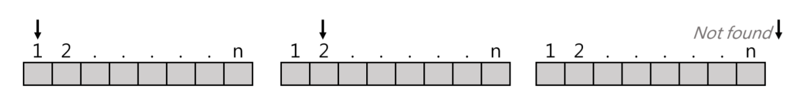
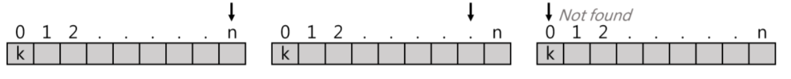
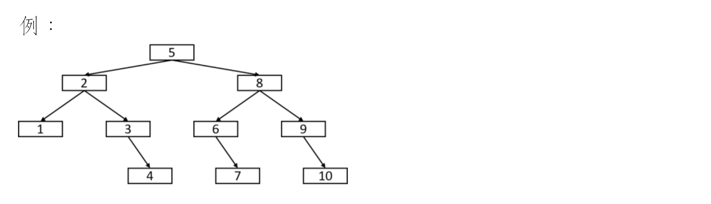
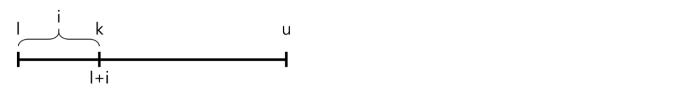
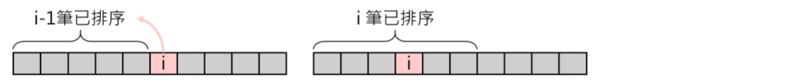

### 搜尋:
* 線性搜尋 Linear search =>不須排序
* 二分搜尋 Binary search =>需先排序 ->建決策樹Decition Tree
* 插補搜尋 Interpolation(IPS)

### 排序:
初階排序:O($n^2$)
* 插入排序 Insertion sort
* 選擇排序 Selection sort
* 泡沫排序 Bubble sort
* 謝爾排序 Shell sort

高階排序:O($nlogn$)
* 快速排序 Quick sort
* 合併排序 Merge sort
* 堆積排序 Heap sort

線性排序:O($n$)
* 基數排序 Radix sort
* 記數排序 Counting sort


# 搜尋
作法:由頭到尾依序對Data一筆筆進行比對並搜尋，可分為:
1. Non-sential Linear search
2. Sentila Linear search

### Non-sential Linear search
Def:由頭開始對key(欲找值)搜尋
- if found => return index(位置)
-    else  => return 0

```C++
void non-sential(F[],n,key){
while (i<=n){
    if(key==F[i])
        return i;
    else
        i++;
  }
return 0;
}
```

#### 分析:
1. 時間複雜度O(n)，平均複雜度=(1+2+3+...+n)=(n+1)/2=O(n)
2. 資料無須做前置排序
3. 支援Sequential(Linked list)或Random Access(Array)之結構，皆可進行
4. 實作容易

### Sential Linear search
Def:
1. 第0格放欲找值key
2. 由後往前找key，找到則return index，否則return 0

```C++
void sential (F[],n,key){
int f[0]=k;
int i=n;
while(F[i]!=key){
i--;
}
return i;
}
```


#### 分析:
1. 效率較non-sential好，因為少一個判別式
2. 多花一格空間(以時間換取空間)
3. 時間複雜度=O(n)

### Binary search
前置作業:
1. Data需事先排序
2. 需支援Random Access(Array可以，Linked list不適合)

概念:
1. f[mid]==key，return mid
2. f[mid]>key，找左半邊，upper = mid-1
3. f[mid]<key，找右半邊，lower = mid+1

遞迴方法
```C++
int BS(f[],key,l,u){
  if(l>u){ //不合理，not found
    retrun -1;
  }
  else{
    int mid = (l+u)/2;
    if (f[mid]==key) return mid;
    else if (f[mid]>key) return BS(f[],key,l,mid-1);
    else return BS(f[],key,mid+1,u);
  }
}
```

非遞迴方法
```C++
int BS(f[],key,l,u){
  int mid = (l+u)/2;
  while(l<=u){
    if(f[mid]==key) return mid;
    else if (f[mid]>k) u = mid - 1;
    else l = mid + 1;
  }
  retrun -1; //not found
}
```
分析:以Recursive:
T(n)= T(n/2)+1 => O(log n)

何時線性搜尋比二元搜尋更適合?
1. 二元搜尋需做排序(最快Quicksort=>O(n logn))，找則花費O(logn)，若只是一次性搜尋，線性搜尋更適合( O(n) )
2. 結構採用linked link
3. 資料會動態增減時

### Binary Search 的 Decision Tree(決策樹)


### 插補搜尋:
  1. 前置作業需排序
  2. 較接近人類搜尋行為

##### 概念:
  

  i = k-d[l]/(d[u]-d[l])*(u-l+1)

  比較d[l+i]及k:
  1. d[l+i]==k，return l+i
  2. d[l+i]>k，u = l+i+1，找左邊
  3. d[l+i]<k，l = l+i+1，找右邊

```C++
int IPS(d[],k,l,u){
  if (l<=u){
  int i = k-d[l]/(d[u]-d[l])*(u-l+1);
  if (d[l+i]==k) retrun l+i;
  else if (d[l+i]>k) return IPS(d[],k,l,l+i+1);//找左邊
  else  return IPS(d[],k,l+i+1,u);//找右邊
  }
  else
    return -1; //not found
}
```
### 初等排序
### Insertion sort
將第i筆資料插入到n-1已排好的串列中，使之成為第i筆已排好的串列

```C++
void insertion_sort(data,n){
  for(int i = 0 ;i < n;i++){
    int key = data[i];
    int j = i-1;
      while(j>0 && data[j]>key){
        data[j+1]=data[j];
        j--;
      }
    data[j+1]=key;
   }
}
```
* Best case:O(n)
* Worst case:O(n^2)
* avg case:O(n^2)
* space O(1)

選擇排序 Selection Sort
從i~n筆資料中挑選最小值，與第i筆資料做swap，反覆做n-1回合
```C++
void Selection_sort(data,n){
int i,j,min;
  for (i=0;i<n-1;i++){
  min = i;
      for(j=i+1;j<n;j++){
          if(data[min]>data[j]){
          min = j;
      }
      if (i!=min){
          swap(data[i],data[min]);
      }
    }
  }
}
```
* Best case: O(n^2)
* Worst case: O(n^2)
* avg case: O(n^2)
* Space :O(1)

氣泡排序 Bubble sort
元素兩兩互相比較，若前者>後者則swap，做n-1回合
```C++
void Bubble_sort(data,n){
  int i,j;
  for(i=1;i<n-1;i++){
    for(j=i+1;j<n;j++){
      if(data[i]>data[j])
        swap(data[i],data[j]);
    }
  }
}
```
* Best case:O(n)
* Worst case:O(n^2)
* avg case:O(n^2)
* Space:O(1)
### 高等排序
### 快速排序 Quicksort
